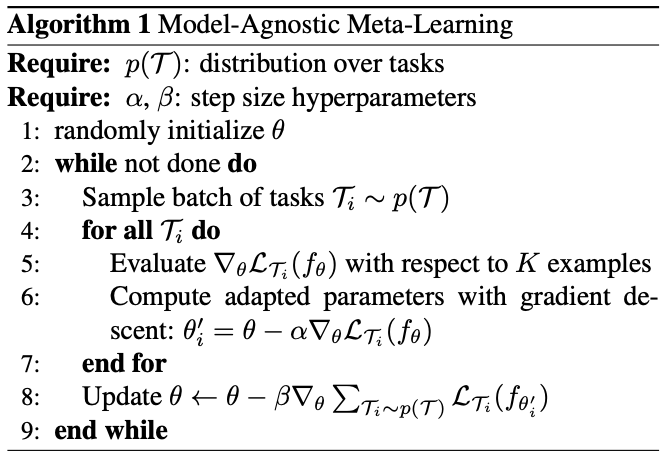

[戻る](../list.md)
# まとめ
勾配降下法を適用できる任意のモデルに対するメタ学習方法.

## タスクの定義
$$
\mathcal{T}=\left\{\mathcal{L}\left(\mathbf{x}_{1},\mathbf{a}_{1},\dots,\mathbf{x}_{H},\mathbf{a}_{H}\right),q\left(\mathbf{x}_{1}\right),q\left(\mathbf{x}_{t+1}\middle|\mathbf{x}_{t},\mathbf{a}_{H}\right),H\right\}
$$
- 通常の教師あり学習であれば、$H=1$ である.
- 強化学習では、$H$ はステップ数とする.

## メタ学習
 
タスクの確率分布 $p\left(\mathcal{T}\right)$ を定め、$\mathcal{T}_{i}$ をサンプリングして学習する. $K$-ショットのメタ学習では $K$ 個のサンプルを用いて $\mathcal{L}_{\mathcal{T}_{i}}$ をフィードバックとして受け取る.
学習では以下のようにパラメータ更新される.
$$
\theta_{i}^{\prime}=\theta-\alpha\nabla_{\theta}\mathcal{L}_{\mathcal{T}_{i}}\left(f_{\theta}\right)
$$
メタ学習では、
$$
\underset{\theta}{\min}\sum_{\mathcal{T}_{i}\sim p\left(\mathcal{T}\right)}\mathcal{L}_{\mathcal{T}_{i}}\left(f_{\theta_{i}^{\prime}}\right)
$$
を満たすように $\theta$ を最適化する.
そのため、パラメータは
$$
\theta\leftarrow\theta-\beta\nabla_{\theta}\sum_{\mathcal{T}_{i}\sim p\left(\mathcal{T}\right)}\mathcal{L}_{\mathcal{T}_{i}}\left(f_{\theta_{i}^{\prime}}\right)
$$
で更新される.

$$
\begin{align*}
    \nabla_{\theta}\mathcal{L}_{\mathcal{T}_{i}}\left(f_{\theta_{i}^{\prime}}\right)&=\frac{\partial\theta_{i}^{\prime}}{\partial\theta}\nabla_{\theta^{\prime}}\mathcal{L}_{\mathcal{T}_{i}}\left(f_{\theta_{i}^{\prime}}\right)\\
    &=\left\{I-\alpha\nabla_{\theta}^{2}\mathcal{L}_{\mathcal{T}_{i}}\left(f_{\theta}\right)\right\}\nabla_{\theta_{i}^{\prime}}\mathcal{L}_{\mathcal{T}_{i}}\left(f_{\theta_{i}^{\prime}}\right)
\end{align*}
$$
であり、$\mathcal{L}_{\mathcal{T}_{i}}$ のヘッセ行列を必要とする.

## 結果
$K$-ショットでSOTAに匹敵し、ヘッセ行列の計算の代わりに一次近似を用いても大きな性能差は生じなかった.
