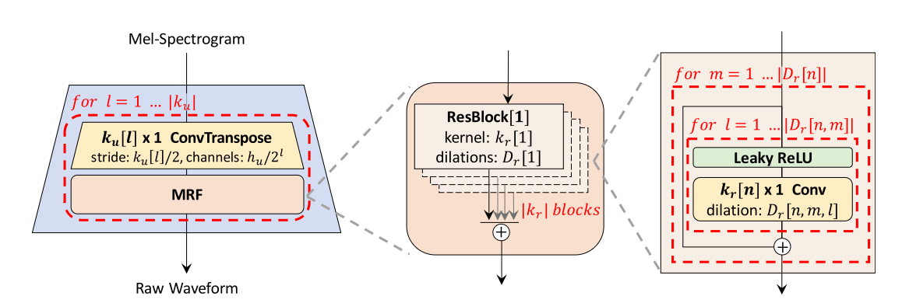
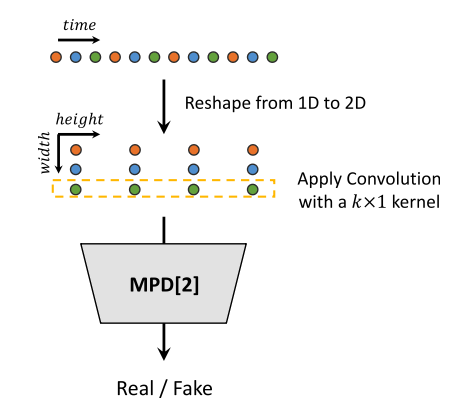
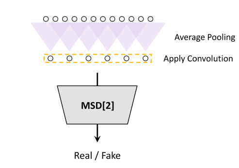

[戻る](../list.md)
# MRF(Multi-Receptive Field Fusion)

# MPD(Multi-Period Discriminator)
 
周期 $p$ が与えられたとき、$T$次元の音声データは $p\times T/p$ の2次元配列に変換される.
間引いてサンプルするのではなく、2次元配列にすることで、ジェネレータに漏れなく勾配を伝えることができる.
この2次元配列には2次元の畳み込み層とLeakyReLU層を交互に適用していくが、各カーネルの幅は1に制限されている(隣接する時刻のデータのみを畳み込みに使う).
各サブDiscriminatorに与えられる $p$ は互いに素.

# MSD(Multi-Scale Discriminator)
 
MPDでは連続でない音声を処理していたので、連続する音声に対する処理もするべきである.
MelGANで使用されていたDiscriminatorをもとに、MSDを作成した.
元の音声($\times1$)に対するサブDiscriminatorにはスペクトル正則化を、そのほかのサブDiscriminatorには重み正則化を施す.

# 損失関数
## GAN損失
$G,D$がそれぞれ生成器・識別器として機能することを促す損失.
$$
\begin{align*}
    \mathcal{L}_{adv}\left(D;G\right)&=\mathbb{E}_{\left(x,s\right)}\left[\left(D\left(x\right)-1\right)^{2}+\left(D\left(G\left(s\right)\right)\right)^{2}\right]\\
    \mathcal{L}_{adv}\left(G;D\right)&=\mathbb{E}_{s}\left[\left(D\left(G\left(s\right)\right)-1\right)^{2}\right]
\end{align*}
$$
## Mel-Spectrogram損失
上記の損失だけだと、$G$は$D$を騙すような音声を生成するだけで「音声」たらしめる保証がない.
そこで以下のような損失を設ける.
$$
\mathcal{L}_{Mel}\left(G\right)=\mathbb{E}_{\left(x,s\right)}\left[\left\|\phi\left(x\right)-\phi\left(G\left(s\right)\right)\right\|_{1}\right]
$$
## 特徴マッチング損失
$G$が$D$を騙すことは、$D$の$x$と$G\left(s\right)$に対する内部表現を近づけることで促進することができる.
$$
\mathcal{L}_{FM}\left(G;D\right)=\mathbb{E}_{\left(x,s\right)}\left[\sum_{i=1}^{T}\left\|D^{i}\left(x\right)-D^{i}\left(G\left(s\right)\right)\right\|_{1}\right]
$$
## 最終損失
$$
\begin{align*}
    \mathcal{L}_{G}&=\sum_{k=1}^{K}\left[\mathcal{L}_{Adv}\left(G;D_k\right)+\lambda_{fm}\mathcal{L}_{FM}\left(G;D_{k}\right)\right]\\
    \mathcal{L}_{D}&=\sum_{k=1}^{K}\mathcal{L}_{Adv}\left(D_{k};G\right)
\end{align*}
$$
