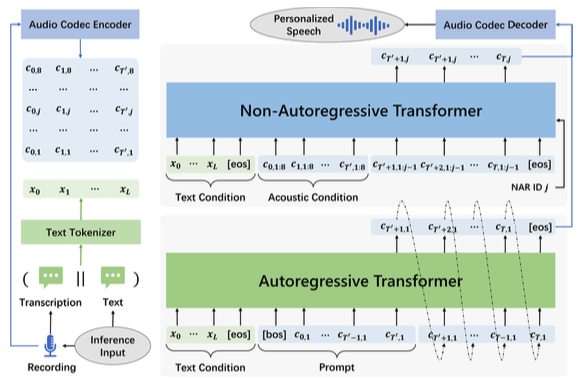

[戻る](../list.md)
# まとめ
- 強力なコンテキスト内学習の能力を持つ VALL-E を提案する.これにより、ファインチューニング等を用いないゼロショット TTS が可能となる.
- 話者レベルで汎化された TTS の実現により、TTS における半教師ありデータの過小評価を訴えた.
- 同じ話者とテキストに対して、音響環境と表情を変えないまま、多様な音声を生成することに成功した.
- LibriSpeech と VCTK でのゼロショット TTS として SOTA.

## 背景
- 音声は各フレームにおいて16ビットの整数として圧縮されて保存されている.
  - このような圧縮においても高品質な音声データとなるように $\mu$-law アルゴリズムが用いられる.
  - 強度 $x$ の音声信号は $F\left(x\right)=\mathrm{sgn}\left(x\right)\frac{\ln\left(1+\mu\left|x\right|\right)}{\ln\left(1+\mu\right)}$ に変換される.
  - 人間の聴覚は対数関数的な強さに反応するという事実に基づく.
- WavNet でも $\mu$-law が一般的に用いられているが、フレーム長の圧縮は行なっていないため、推論には時間がかかる.
- 最近、vq-wav2vec や HuBERT などの特徴量抽出モデルが、自己教師あり学習においてベクトル量子化を用いている.
  - 推論速度は速いが、話者の個性が失われ、再構成における品質が低いという課題がある.
- AudioLM は、自己教師あり学習による k-means コードと NAC による音響コードとの両方を用いて高品質な音声生成を実現した.
  - AudioLM は、音声からその続きを予測するモデルである.
- VALL-E では AudioLM にしたがったゼロショットモデルを構築した.
  - 24kHz の音声データに対して、75Hz での埋め込みを作成する.
  - $24K/75=320$ 倍の圧縮率となる.
  - 各埋め込みは、8階層の10bit(1024entries)量子化器からなる.
  - フレーム長は $75\times10=750$ である.

## VALL-E
### 定式化
| シンボル | 式 | 意味 |
|:-:|:-:|:-:|
| $T^{\prime}$ | $24\mathrm{K}\times10/320=750$ | 10秒間のプロンプトにおけるフレーム長 |
| $T$ | $\left(T>T^{\prime}\right)$ | ダウンサンプリングされたフレーム長 |
| $\mathbf{x}$ | $\left[x_{0},\dots,x_{L}\right]$ | 発音記号系列 |
| $\mathbf{y}$ |  | 音声サンプル |
| $\text{Codec\_Encoder}\left(\cdot\right)$ |  | エンコーダー(事前学習済み) |
| $\text{Codec\_Decoder}\left(\cdot\right)$ |  | デコーダー(事前学習済み) |
| $\mathbf{C}$ | $\left[\mathbf{c}_{0,:},\dots,\mathbf{c}_{T,:}\right]\\\mathbf{c}_{t,j}\in\left\{0,1\right\}^{10}$ | 音響プロンプト行列 |

### Codec言語モデルとしての TTS
TTS の損失関数を以下のように変形すると、条件付き言語モデルとして扱うことができる.
$$
\begin{align*}
    \mathcal{L}&=-\log p\left(\mathbf{C}\middle|\mathbf{x};\theta\right)\\
    &=-\log\prod_{t=0}^{T}p\left(\mathbf{c}_{t,:}\middle|\mathbf{c}_{<t,:},\mathbf{x};\theta\right)
\end{align*}
$$

### 推論時のCodec言語モデル
適応話者の音声 $\mathbf{y}^{\prime}$ とそれに対応する音響プロンプト $\mathbf{C}^{P}=\mathbf{C}_{\leq T^{\prime},:}=\left[\mathbf{c}_{0,:},\dots,\mathbf{c}_{T^{\prime},:}\right]$ が与えられたとして、$\mathbf{C}^{T}=\mathbf{C}_{T^{\prime}<,:}=\left[\mathbf{c}_{T^{\prime}+1,:},\dots,\mathbf{c}_{T,:}\right]$ を以下のように決定したい.
$$
\begin{align*}
    \mathbf{C}^{T}&=\underset{\mathbf{C}^{T}}{\arg\max}\,p\left(\mathbf{C}^{T}\middle|\mathbf{C}^{P},\mathbf{x};\theta\right)\\
    &=\underset{\mathbf{C}^{T}}{\arg\max}\prod_{t=T^{\prime}+1}^{T}p\left(\mathbf{c}_{t,:}\middle|\mathbf{c}_{<t,:},\mathbf{x};\theta\right)
\end{align*}
$$

### ARとNARにおける階層構造
RVQ を採用した NAC には以下2つの特徴が見られる.
- 複数の量子化器による符号化
- 最初の符号が音響情報の大半をカバーし、他が残差として詳細な情報を提供する.

これを踏まえて VALL-E では、AR(自己回帰)および NAR(非自己回帰)モデルの2つのモデルを導入した.
AR モデルは最初の符号を自己回帰的に生成し、NAR モデルは残りの符号を非自己回帰的に生成する.

これら2つのモデルは、テキスト埋め込み層・符号埋め込み層・符号予測層において同じアーキテクチャを採用している.
また、符号予測層・符号埋め込み層で[埋め込みのの共有](WeightTying.md)を行なっている.

## 学習

### 1.ARモデルの学習
AR モデルは、与えられたテキスト系列 $\mathbf{x}$ に対して $\mathbf{c}_{:,1}$ を自己回帰によって予測(生成)するように学習される.

まず、テキスト埋め込み行列 $\mathbf{W}^{x}$ と符号埋め込み $\mathbf{W}^{c}$ を用いて埋め込み系列を作成する.
$$
\begin{align*}
  \mathbf{E}^{x}&=\left[\mathbf{e}_{0}^{x},\dots,\mathbf{e}_{L}^{x}\right]\quad\text{where}\quad\mathbf{e}_{i}^{x}=\mathbf{W}^{c}\odot x_{i}\\
  \mathbf{E}^{c}&=\left[\mathbf{e}_{0}^{c},\dots,\mathbf{e}_{T}^{c}\right]\quad\text{where}\quad\mathbf{e}_{t}^{c}=\mathbf{W}^{c}\odot c_{t,1}
\end{align*}
$$
$\odot$ はインデックス選択である.

また、結合 $||$ を用いて Transformer への入力を
$$
\mathbf{E}=\mathbf{E}^{x}\,||\left[\mathbf{e}_{\text{<eos>}},\mathbf{e}_{\text{<bos>}}\right]||\,\mathbf{E}^{c}
$$
とする.
\<eos>はテキスト埋め込みの受け取り終了を伝えるためのトークンで、\<bos>は次の符号の予測を開始することを伝えるためのトークンである.

以下で定める損失関数の最小化を目的としてモデル $\theta_{AR}$ を学習する.
$$
\begin{align*}
  \mathcal{L}_{AR}&=-\log\,p\left(\mathbf{c}_{:,1}\middle|\mathbf{x};\theta_{AR}\right)\\
  &=-\log\prod_{t=0}^{T}p\left(\mathbf{c}_{t,1}\middle|\mathbf{c}_{<t,1},\mathbf{x};\theta_{AR}\right)
\end{align*}
$$

### 2.NARモデルの学習
$\mathbf{c}_{:,j}$ を $\mathbf{x}$ と $\mathbf{C}_{:,<j}$ を用いて非自己回帰的に生成する$\left(j\in\left[2,\dots,8\right]\right)$.

Encodec からの出力 $\mathbf{C}$ とランダムに選ばれた $T^{\prime}$ を用いて、$\mathbf{C}_{:T^{\prime},:}$ を音響条件とする.
NAR モデルは$\mathbf{c}_{T^{\prime}<,j}$ をターゲットとして、これを $\mathbf{C}_{:,<j}$ から非自己回帰的に生成するように最適化される.

$\mathbf{E}^{x}$ は AR モデルと同じものを用いる.
$\mathbf{E}^{c}$ は未計算領域があるため、以下のように定める.
$$
\mathbf{e}_{t}^{c}=\begin{cases}
\sum_{k=1}^{8}\mathbf{W}^{c}\odot c_{t,k} & t\leq T^{\prime}\\
\sum_{k=1}^{j-1}\mathbf{W}^{c}\odot c_{t,k} & t>T^{\prime}
\end{cases}
$$
ID 埋め込みには学習可能な埋め込みを用いる.
$$
\mathbf{e}^{id}=\mathbf{W}^{id}\odot j
$$
これらを用いて Transformer への入力を以下のように定める.
$$
\mathbf{E}=\mathbf{E}^{x}\,||\left[\mathbf{e}_{\text{<eos>}}\right]||\,\mathbf{E}^{c}\,||\,\left[\mathbf{e}_{\text{<eos>}},\mathbf{e}^{id}\right]
$$
AR モデルの Transformer への入力とは異なり、\<bos>を用いないのは、NAR モデルは非自己回帰的に $j$ 番目の階層の符号を一括で出力するためである.

次の損失関数を最小化するようにモデル $\theta_{NAR}$ を学習する.
$$
\begin{align*}
  \mathcal{L}_{NAR}&=-\log p\left(\mathbf{C}_{>T^{\prime},>1}\middle|\mathbf{x},\mathbf{C}_{<T^{\prime},:},\mathbf{c}_{>T^{\prime},1};\theta_{NAR}\right)\\
  &=-\sum_{j=2}^{8}\log p\left(\mathbf{c}_{>T^{\prime},j}\middle|\mathbf{x},\mathbf{C}_{<T^{\prime},:},\mathbf{C}_{>T^{\prime},<j};\theta_{NAR}\right)
\end{align*}
$$
学習時には $j$ をランダムに選んで、以下の損失関数を採用する.
$$
\mathcal{L}_{NAR\_\text{step}}=-\log p\left(\mathbf{c}_{>T^{\prime},j}\middle|\mathbf{x},\mathbf{C}_{<T^{\prime},:},\mathbf{C}_{>T^{\prime},<j};\theta_{NAR}\right)
$$

## 推論

プロンプト $\mathbf{C}^{P}=\mathbf{C}_{:T^{\prime},:}=\left[\mathbf{c}_{0,:},\dots,\mathbf{c}_{T^{\prime},:}\right]$ が与えられたとき、AR モデルと NAR モデルが $\mathbf{C}_{>T^{\prime},:}=\left[\mathbf{c}_{T^{\prime}+1,:},\dots,\mathbf{c}_{T,:}\right]$ を生成する.

AR モデルは次のような推論をして、$\mathbf{c}_{>T^{\prime},1}$ を生成する.
$$
\begin{align*}
  \mathbf{c}_{>T^{\prime},1}&=\underset{\mathbf{c}_{>T^{\prime},1}}{\arg\max}\,p\left(\mathbf{c}_{>T^{\prime},1}\middle|\mathbf{x},\mathbf{c}_{:T^{\prime},1};\theta_{AR}\right)\\
  &=\underset{\mathbf{c}_{>T^{\prime},1}}{\arg\max}\prod_{t=T^{\prime}+1}^{T}p\left(c_{t,1}\middle|\mathbf{x},\mathbf{c}_{<t,1};\theta_{AR}\right)
\end{align*}
$$
$c_{t,1}$ は確率分布に従ってランダムに選ばれ、次の符号の予測に使われる.

NAR モデルは次の推論をして、 $\mathbf{C}_{>T^{\prime},>1}$ を生成する.
$$
\begin{align*}
  \mathbf{C}_{>T^{\prime},>1}&=\underset{\mathbf{C}_{>T^{\prime},>1}}{\arg\max}\,p\left(\mathbf{c}_{>T^{\prime},>1}\middle|\mathbf{x},\mathbf{C}_{:T^{\prime},:},\mathbf{C}_{>T^{\prime},1};\theta_{NAR}\right)\\
  &=\underset{\mathbf{C}_{>T^{\prime},>1}}{\arg\max}\prod_{j=2}^{8}p\left(\mathbf{c}_{>T^{\prime},j}\middle|\mathbf{x},\mathbf{C}_{:T^{\prime},:},\mathbf{C}_{>T^{\prime},<j};\theta_{NAR}\right)
\end{align*}
$$
