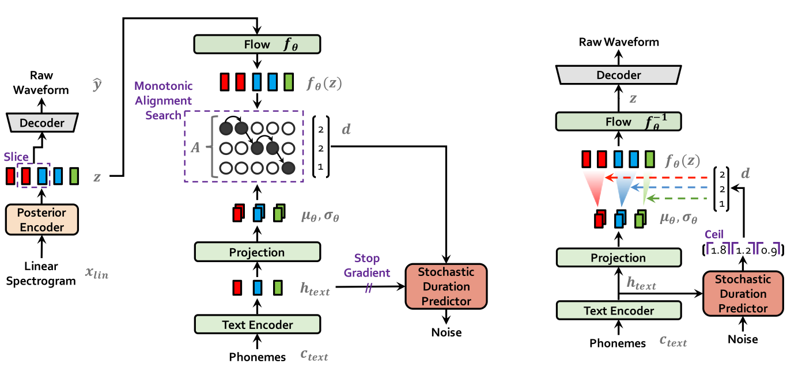

[戻る](../list.md)
# 要約
変分推論を用いた、End-to-End の TTS の学習方法 VIT の提案.

## 概要
| シンボル | 意味 | 
|:-:|:-:|
| $\theta$ | 推論時に用いるモデル |
| $\phi$ | 学習時に教師とされるモデル(非凍結) |

- Posterior エンコーダー $p_{\phi}\left(z\middle|x\right)$
  - posterior エンコーダーが音声波形の入力 $x$ から、$\mu_{\phi},\sigma_{\phi}$ を出力する.
  - $z\sim\mathcal{N}\left(z;\mu_{\phi},\sigma_{\phi}\right)$ をサンプルする.
- Flow ベースモデル $f_{\theta}$
  - posterior エンコーダーの出力分布を、text エンコーダーの出力分布へ変換する.
  - その逆変換 $f_{\theta}^{-1}$ も存在する.
- Text エンコーダー $p_{\theta}\left(z\middle|c\right)$
  - テキスト条件 $c$ から、隠れ状態 $h_{text}$ を生成し、線形変換によって $\mu_{\theta},\sigma_{\theta}$ を得る.
- アライメント関数 $A$ (学習時)
  - $f_{\theta}\left(z\right)\sim\mathcal{N}\left(f_{\theta}\left(z\right);\mu_{\theta},\sigma_{\theta}\right)$ と考えられるかどうかを基に、$f_{\theta}\left(z\right)$ を動的計画法によってアライメントし、duration $d$ を得る.
- duration predictor
  - $d$ を正解データと仮定し、$h_{text}$ からこれを再現することを学習.
  - 他のモデルへは勾配を流さない.

VITS は、条件付き変分オートエンコーダー $p_{\theta}\left(x\middle|c\right)$ における変分下限(ELBO)の最大化と表現することができる.
$$
\log\,p_{\theta}\left(x\middle|c\right)\geq\mathbb{E}_{q_{\phi}\left(z\middle|x\right)}\left[\log\,p_{\theta}\left(x\middle|z\right)-\log\frac{q_{\phi}\left(z\middle|x\right)}{p_{\theta}\left(z\middle|c\right)}\right]
$$

## 再構成損失
- 音声波形 $x$ が与えられると、エンコーダーはそれに対応する潜在変数のパラメータを出力する.
- その確率分布に従う潜在ベクトル $z$ をサンプルし、デーコーダーで音声波形 $\hat{x}$ を再構成する.
- また、それぞれに対応するメルスペクトログラム $x_{mel},\hat{x}_{mel}$ が計算される.

このときの損失は、
$$
L_{recon}=\left\|x_{mel}-\hat{x}_{mel}\right\|_{1}
$$
となる.
人間の聴覚特性に基づくため、音声波形でなくメルスペクトログラムを用いる.

## KL距離
$x_{lin}$ が与えられたときの潜在変数 $z$ の確率分布と、$x$ に対応する $c_{text},A$ が与えられたときの $z$ の確率分布は一致するべきである.
$$
L_{kl}=\log\,q_{\phi}\left(z\middle|x_{lin}\right)-\log\,p_{\theta}\left(z\middle|c_{text},A\right)
$$
$$
z\sim q_{\phi}\left(z\middle|x_{lin}\right)=\mathcal{N}\left(z;\mu_{\phi}\left(x_{lin}\right),\sigma_{\phi}\left(x_{lin}\right)\right)
$$
text エンコーダーの出力分布と posterior エンコーダーの出力分布は一般的に異なる(異なって良い).
$$
p_{\theta}\left(z\middle|c\right)=\mathcal{N}\left(f_{\theta}\left(z\right);\mu_{\theta}\left(c\right),\sigma\left(c\right)\right)\left|\det\frac{\partial f_{\theta}\left(z\right)}{\partial z}\right|\quad\text{where}\quad c=\left[c_{text},A\right]
$$

## アライメント関数
[Glow-TTS](GlowTTS.md) における MAS でのアライメント予測では、尤度そのものを最大化していた.
$$
\begin{align*}
  A&=\underset{\hat{A}}{\arg\max}\,\log\,p\left(x\middle|c_{text},\hat{A}\right)\\
  &=\underset{\hat{A}}{\arg\max}\,\log\mathcal{N}\left(f\left(x\right);\mu\left(c_{text},\hat{A}\right),\sigma\left(c_{text},\hat{A}\right)\right)
\end{align*}
$$
しかし、VITS では尤度の変分下限の最大化を目的としているため、次のようにするべきである.
つまり、
$$
\begin{align*}
  A&=\underset{\hat{A}}{\arg\max}\left\{\log\,p_{\theta}\left(x_{mel}\middle|c_{text},\hat{A}\right)-\log\frac{q_{\phi}\left(z\middle|x_{lin}\right)}{p_{\theta}\left(z\middle|c_{text},\hat{A}\right)}\right\}\\
  &=\underset{\hat{A}}{\arg\max}\,\log\,p_{\theta}\left(z\middle|c_{text},\hat{A}\right)\\
  &=\underset{\hat{A}}{\arg\max}\,\log\mathcal{N}\left(f_{\theta}\left(z\right);\mu_{\theta}\left(c_{text},\hat{A}\right),\sigma_{\theta}\left(c_{text},\hat{A}\right)\right)
\end{align*}
$$
となり、結局は MAS と同じ枠組みを使うことができる.

## duration 生成器
- Duration エンコーダー $q_{\phi}\left(u,\nu\middle|c_{text},d\right)$
  - 入力 $c_{text},d$ に対して、非量子化確率変数 $u\in\left[0,1\right)$ を生成する確率分布のパラメータを出力.
  - 潜在変数 $\nu$ を生成する確率分布のパラメータを出力.
- Duration 予測器 $p_{\theta}\left(d,\nu\middle|c_{text}\right)$
  - 入力 $c_{text}$ に対して、duration $d$ および潜在変数 $\nu$ を生成する確率分布のパラメータを出力.
  - 学習時には $q_{\phi}$ の出力に対して $d-u,\nu$ を出力することを目指す.

$$
\log\,p_{\theta}\left(d\middle|c_{text}\right)\geq\mathbb{E}_{q_{\phi}\left(u,\nu\middle|d,c_{text}\right)}\left[\log\frac{p_{\theta}\left(d-u,\nu\middle|c_{text}\right)}{q_{\phi}\left(u,\nu\middle|d,c_{text}\right)}\right]\eqqcolon L_{dur}
$$
  
推論時には潜在表現 $z$ をサンプルした後逆フロー変換を用いて、$d,\nu$ の生成をする.

## 敵対学習
| シンボル | 意味 |
|:-:|:-:|
| $G$ | 生成器 |
| $D$ | 識別器 |
| $y$ | 本物の音声波形 |
| $z$ | 潜在変数 |
- $D$ の予測の正確さを保証するための損失関数
$$
L_{adv}\left(D\right)=\mathbb{E}_{y,z}\left[\left(D\left(y\right)-1\right)^{2}+\left(D\left(G\left(z\right)\right)\right)^{2}\right]
$$
- $G$ の生成能力を保証するための損失関数
$$
L_{adv}\left(G\right)=\mathbb{E}_{z}\left[\left(D\left(G\left(z\right)\right)-1\right)^{2}\right]
$$
- $G$ が $D$ を騙すために、$D$ が本物を識別するときの各層における表現を真似するための損失関数
$$
L_{fm}\left(G\right)=\mathbb{E}_{\left(y,z\right)}\left[\sum_{l=1}^{T}\frac{1}{N_{l}}\left\|D^{l}\left(y\right)-D^{l}\left(G\left(z\right)\right)\right\|_{1}\right]
$$

## 最終的な損失関数
$$
L_{vae}=L_{recon}+L_{kl}+L_{dur}+L_{adv}\left(G\right)+L_{fm}\left(G\right)
$$
