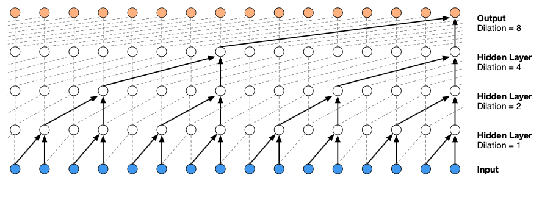
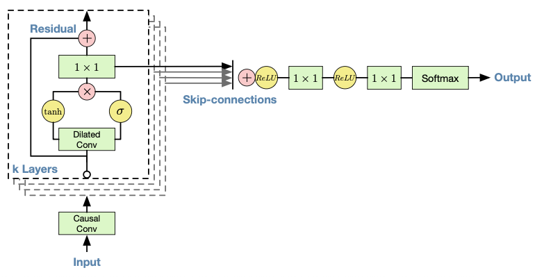

[戻る](../list.md)
# 要約

# WaveNet
## タスク
音声波形 $\mathbf{x}=\left\{x_{1,\dots,x_{L}}\right\}$ を生成する確率は、以下の条件付き確率の積に分解することができる.
$$
p\left(\mathbf{x}\right)=\prod_{t=1}^{T}p\left(x_{t}\middle|x_{1},\dots,x_{t-1}\right)
$$
## 膨張畳み込み
 
ditlation を $\mathbf{d}=\left[1,2,4,\dots,512,1,2,4,\dots,512,1,2,4,\dots,512\right]$ とする.
$i$ 層目における畳み込みはカーネル $K$ を用いて、
$$
h_{i+1,t}=\sum_{j=0}^{1024/d_{i}-1}K_{j}^{\left(i\right)}h_{i,t-jd_{i}}
$$
1 ブロックの dilation $\left[1,2,4,\dots,512\right]$ における受容野サイズは $1024$ である.
$1\times1024$ の1次元畳み込みと比べて、膨張畳み込みは非線形性による識別能力が高い.

## Softmax 分布
音声データは 16 bit 整数で保存されているため、softmax は $2^{16}=65,536$ 種類の確率分布を出力する必要がある.
扱いやすくするために、音声信号 $x_{t}$ に $\mu$-law 変換を施す.
$$
x_{t}\leftarrow f\left(x_{t}\right)=\mathrm{sgn}\left(x_{t}\right)\frac{\ln\left(1+\mu\left|x_{t}\right|\right)}{\ln\left(1+\mu\right)}\quad\text{where}\quad\mu=255
$$
これは人間の聴覚の特性に基づく線形信号へのへんかんのため、高い品質を保ったまま 16 bit に量子化することができる.

## ゲート付き活性化ユニット
$k$ 層目における隠れ状態 $\mathbf{x}$ が与えられたとして、
$$
\mathbf{z}=\tanh\left(W_{f,k}\ast\mathbf{x}\right)\odot\sigma\left(W_{g,k}\ast\mathbf{x}\right)
$$
によって活性化される.

## 残差接続とスキップ接続
 
残差接続によって $\mathbf{x}+\alpha\,\mathbf{z}$ を $\left(k+1\right)$ 層目に受け渡す.
また、$\alpha\,\mathbf{z}$ はスキップ接続として出力に用いられる.

## 条件付け
音声波形の生成に $\mathbf{h}$ で条件付けられたとき、生成確率は
$$
p\left(\mathbf{x}\middle|\mathbf{h}\right)=\prod_{t=1}^{T}p\left(x_{t}\middle|x_{1},\dots,x_{t-1},\mathbf{h}\right)
$$
となり、各層における出力を
$$
\mathbf{z}=\tanh\left(W_{f,k}\ast\mathbf{x}+V_{f,k}^{\top}\ast\mathbf{h}\right)\odot\sigma\left(W_{g,k}\ast\mathbf{x}+V_{g,k}^{\top}\ast\mathbf{h}\right)
$$
とする.
$V^{\top}$ は、$\mathbf{x}$ の系列長を出力長へ変換する.
特に短い系列長の場合は、転置畳み込み $\mathbf{y}=f\left(\mathbf{h}\right)$ で変換後、
$$
\mathbf{z}=\tanh\left(W_{f,k}\ast\mathbf{x}+V_{f,k}\ast\mathbf{y}\right)\odot\sigma\left(W_{g,k}\ast\mathbf{x}+V_{g,k}\ast\mathbf{y}\right)
$$
とする.
ここで、$V$ はスカラーで $V\ast\mathbf{y}$ は $1\times1$ の畳み込みに相当する.

## 文脈スタック
さまざまな手法を利用して受容野を広げてきたが、これは計算コストを膨大にする.
そこで、別のネットワークを用いて入力全体の状態(スタック)をあらかじめ計算しておいて、WaveNet では狭い受容野で計算をすることを提案する.
また、スタックにプーリングを用いれば、低い周波数での表現も獲得することができる.
