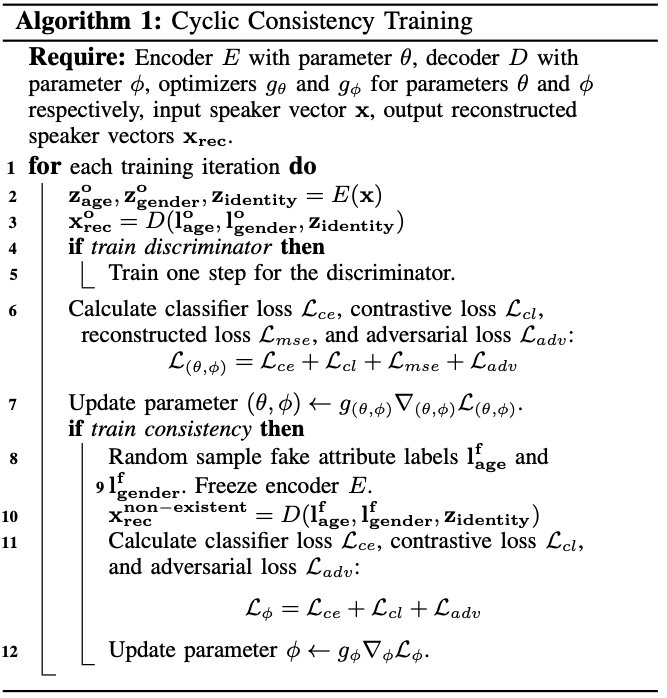

[戻る](../list.md)
# 要約
- SRVAE
  - 話者の属性抽出
- TSVC
  - 条件付き音声変換

によって、音声における話者の属性をコントロールする.
- 年齢および性別のコントロールに成功
- SRVAE を提案し、年齢と性別のラベルを用いて存在しない話者表現を生成することに成功
- TSVC を提案し、異なる話者間で属性を共有することに成功

## SRVAE(Speaker Representation Variational Autoencoder)

- エンコーダーが潜在表現 $\mathbf{z}_{\text{age}}^{\text{o}},\mathbf{z}_{\text{gender}}^{\text{o}},\mathbf{z}_{\text{identity}}$ を生成する.
  - $\mathbf{z}_{\text{age}}^{\text{o}},\mathbf{z}_{\text{gender}}^{\text{o}}$ は線形変換によって確率分布に変換され、分類タスクとしてトレーニングされる.
  - $\mathbf{z}_{\text{idenity}}$ は $\cos$ 類似度を用いた対照学習によって、同話者間での整合性と別話者間での識別性を持つように学習される.
- デコーダーは、$\mathbf{z}_{\text{identity}}$ と話者の属性ラベル $\mathbf{l}_{\text{age}}^{\text{o}},\mathbf{l}_{\text{gender}}^{\text{o}}$ を用いて、音声波形を生成する.
  - 生成された音声波形と元の音声波形は、Discriminator を用いて敵対学習される.
  - エンコーダーを凍結した状態で、生成した音声の擬似的な性別や年齢を分類し、一貫性を保つ.

これによって $\mathbf{z}_{\text{identity}}$ がその他の属性の情報を含んでいたとしても再構成時にその情報を使わないようにすることができる.

## TSVC(Two-Stage Voice Conversion)
- 平均音声 $X_{0}$
  - 音素と基本周波数、属性ラベルから生成する.
  - 話者の個人性は混入していないと考えられる.
- 話者特有音声 $X_{T}$
  - $X_{t}=\left(1-t\right)\left(X_{0}+\xi\right)+tX_{T}$
  - Transformer が $dX_{t}$ の予測をする.
