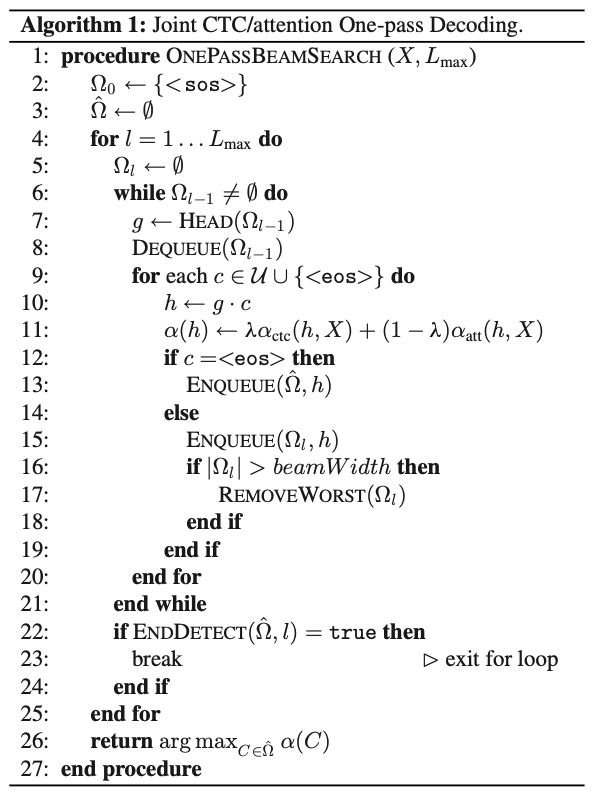
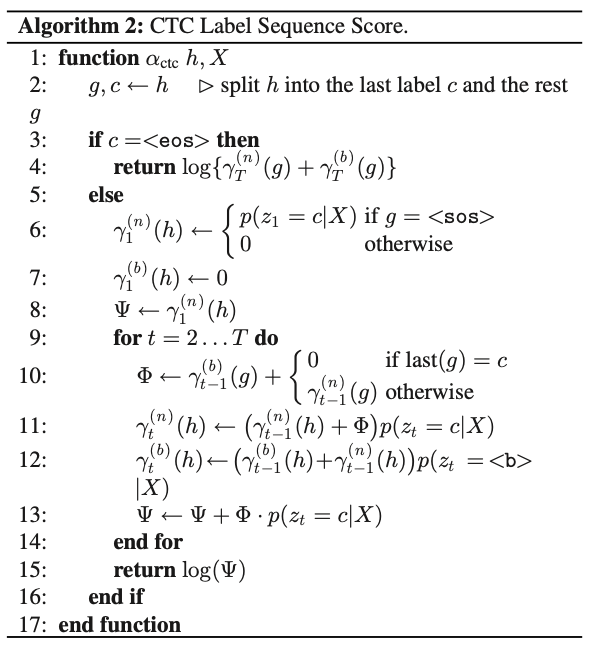

[戻る](VPC2022.md)
# HMM/DNN
## 目的関数
$$
\hat{W}=\underset{W\in\mathcal{V}\ast}{\arg\max}\,p\left(W\middle|X\right)
$$
$$
\begin{align*}
    \text{音声特徴系列}&&X&=\left\{x_{t}\in\mathbb{R}^{D}\middle|t=1,\dots,T\right\}\\
    \text{単語系列}&&W&=\left\{w_{n}\in\mathcal{V}\middle|n=1,\dots,N\right\}\\
    \text{音素系列}&&S&=\left\{s_{t}\in\left\{1,\dots,J\right\}\middle|t=1,\dots,T\right\}
\end{align*}
$$
$$
\begin{align*}
    \underset{W\in\mathcal{V}\ast}{\arg\max}\,p\left(W\middle|X\right)&=\underset{w\in\mathcal{V}*}{\arg\max}\sum_{S}p\left(X\middle|S,W\right)p\left(S\middle|W\right)p\left(W\right)\\
    &\approx\underset{w\in\mathcal{V}*}{\arg\max}\sum_{S}p\left(X\middle|S\right)p\left(S\middle|W\right)p\left(W\right)\\
\end{align*}
$$
$p\left(X\middle|S,W\right)\approx p\left(X\middle|S\right)$ は、音声は音素系列によって定まり、単語系列には依存しないという仮定である.

### 音響モデル $p\left(X\middle|S\right)$
$$
\begin{align*}
    p\left(X\middle|S\right)&=\prod_{t=1}^{T}p\left(x_{t}\middle|x_{1},\dots,x_{t-1},S\right)\\
    &\approx\prod_{t=1}^{T}p\left(x_{t}\middle|s_{t}\right)\propto\prod_{t=1}^{T}\frac{p\left(s_{t}\middle|x_{t}\right)}{p\left(s_{t}\right)}
\end{align*}
$$
$p\left(x_{t}\middle|x_{1},\dots,x_{t-1},S\right)\approx p\left(x_{t}\middle|s_{t}\right)$ は、音声は1つの音素から定まり、音素および音声系列に依存しないというかなり強い仮定である.

### 辞書モデル $p\left(S\middle|W\right)$
$$
\begin{align*}
    p\left(S\middle|W\right)&=\prod_{t=1}^{T}p\left(s_{t}\middle|s_{1},\dots,s_{n-1},W\right)\\
    &\approx\prod_{t=1}^{T}p\left(s_{t}\middle|s_{t-1},W\right)
\end{align*}
$$
$p\left(s_{t}\middle|s_{1},\dots,s_{n-1},W\right)\approx p\left(s_{t}\middle|s_{t-1},W\right)$ は音素の1階マルコフ性の仮定である.

$W$ が与えられて初めて計算可能であり、実際には動的計画法によって解かれる.

### 言語モデル $p\left(W\right)$
$$
\begin{align*}
    p\left(W\right)&=\prod_{n=1}^{N}p\left(w_{n}\middle|w_{1},\dots,w_{n-1}\right)\\
    &\approx\prod_{t=1}^{T}p\left(w_{n}\middle|w_{n-m-1,\dots,w_{n-1}}\right)
\end{align*}
$$
$p\left(w_{n}\middle|w_{1},\dots,w_{n-1}\right)\approx p\left(w_{n}\middle|w_{n-m-1},\dots,w_{n-1}\right)$ は単語の$\left(m-1\right)$階マルコフ性の仮定で、$m$-グラムモデルとして実装されている.

## 結論
モデルの分解と独立性の過程により、音声認識が困難である.

# CTCベース
$$
\begin{align*}
    C&=\left\{c_{l}\in\mathcal{U}\middle|l=1,\dots,L\right\}\\\\
    C^{\prime}&=\left\{\text{<b>},c_{1}^{\prime},\text{<b>},c_{2}^{\prime},\text{<b>},\dots,c_{L}^{\prime},\text{<b>}\right\}\\
    &=\left\{c_{l}^{\prime}\in\mathcal{U}\cup\left\{\text{<b>}\right\}\middle|l=1,\dots,2L+1\right\}
\end{align*}
$$
文字系列が上記の $C$ や $C^{\prime}$ のような形式で与えられる.

## 目的関数
$$
\hat{C}=\underset{C\in\mathcal{U}\ast}{\arg\max}\,p\left(C\middle|X\right)
$$
$$
\begin{align*}
    \text{フレーム単位文字系列}&&Z=\left\{z_{t}\in\mathcal{U}\cup\left\{\text{<b>}\right\}\middle|t=1,\dots,T\right\}
\end{align*}
$$
$$
\begin{align*}
    p\left(C\middle|X\right)&=\sum_{Z}p\left(C\middle|Z,X\right)p\left(Z\middle|X\right)\\
    &\approx\sum_{Z}p\left(C\middle|Z\right)p\left(Z\middle|X\right)
\end{align*}
$$
$p\left(C\middle|Z,X\right)\approx p\left(C\middle|Z\right)$ は、フレーム単位文字系列$Z$が与えられたとき、文字系列$C$は音声特徴系列$X$に依存しないという妥当な仮定による.
| シンボル　| 定義式・更新式 | 意味 |
|:-:|:-:|:-:|
| $\mathbf{h}_{t}$ | $\mathbf{h}_{t}=\text{BLSTM}_{t}\left(X\right)$ | 入力 $X$ の時刻 $t$ での隠れ状態 |
| $z_{t}$ | - | 時刻 $t$ が出力 $z_{t}$に対応する |

### CTC音響モデル $p\left(Z\middle|X\right)$
$$
\begin{align*}
    p\left(Z\middle|X\right)&=\prod_{t=1}^{T}p\left(z_{t}\middle|z_{1},\dots,z_{t-1},X\right)\\
    &\approx\prod_{t=1}^{T}p\left(z_{t}\middle|X\right)
\end{align*}
$$
$p\left(z_{t}\middle|z_{1},\dots,z_{t-1},X\right)\approx p\left(z_{t}\middle|X\right)$ は、音声特徴系列$X$が与えられたときにフレーム単位系列はそれ以前の音声特徴系列に依存しないという仮定である.
$$
\begin{align*}
    p\left(z_{t}\middle|X\right)&=\operatorname{Softmax}\left(\operatorname{LinB}\left(h_{t}\right)\right)\\
    h_{t}&=\operatorname{BLSTM}_{t}\left(X\right)
\end{align*}
$$
$\text{LinB}\left(\cdot\right)$ は線形層で、隠れ状態 $h_{t}$ を $\left(\left|\mathcal{U}\right|+1\right)$ 次元に変換する.
$+1$ は $\text{<b>}$ を意味する.

### CTC文字モデル $p\left(C\middle|Z\right)$
$$
\begin{align*}
    p\left(C\middle|Z\right)&=\frac{p\left(Z\middle|C\right)p\left(C\right)}{p\left(Z\right)}\\
    &=\prod_{t=1}^{T}p\left(z_{t}\middle|z_{1},\dots,z_{t-1},C\right)\frac{p\left(C\right)}{p\left(Z\right)}\\
    &\approx\prod_{t=1}^{T}p\left(z_{t}\middle|z_{t-1},C\right)\frac{p\left(C\right)}{p\left(Z\right)}
\end{align*}
$$
$p\left(z_{t}\middle|z_{1},\dots,z_{t-1},C\right)\approx p\left(z_{t}\middle|z_{t-1},C\right)$ は、短期依存性による仮定である.

$Z$ は全列挙されるため、短期依存性も考慮すると、以下の確率で生成されたと考えるのは自然である.
$$
p\left(z_{t}\middle|z_{t-1},C\right)\propto
\begin{cases}
    1 & z_{t}=c_{l}^{\prime}\text{ and } z_{t-1}=c_{l}^{\prime}\quad\text{for all possible }l\\
    1 & z_{t}=c_{l}^{\prime}\text{ and } z_{t-1}=c_{l-1}^{\prime}\quad\text{for all possible }l\\
    1 & z_{t}=c_{l}^{\prime}\text{ and } z_{t-1}=c_{l-2}^{\prime}\quad\text{for all possible even }l\\
    0 & \text{otherwise}\\
\end{cases}
$$
第3行目で、$l$ を偶数に制限している理由としては、$z_{t}=c_{l}$ となる $t,l$ の存在、つまり文字はどこかで発音されていたということを保証するためである.

### 目的関数の変形
$$
p\left(C\middle|X\right)\approx\underbrace{\sum_{Z}\prod_{t=1}^{T}p\left(z_{t}\middle|z_{t-1},C\right)p\left(z_{t}\middle|X\right)}_{\triangleq p_{\text{ctc}}\left(C\middle|X\right)}\frac{p\left(C\right)}{p\left(Z\right)}
$$
HMM/DNNと似ているが、ベイズの定理を適用するモデルが異なる.

辞書モデルやHMMの構築が不要である.

# Attensionベース
## 目的関数
$$
\hat{C}=\underset{C\in\mathcal{U}\ast}{\arg\max}\,p\left(C\middle|X\right)
$$
$$
p\left(C\middle|X\right)\approx\underbrace{\prod_{l=1}^{L}p\left(c_{l}\middle|c_{1},\dots,c_{l-1},X\right)}_{\triangleq p_{\text{att}}\left(C\middle|X\right)}
$$
$p_{\text{att}}\left(C\middle|X\right)$ はAttensionベースの目的関数である.

## Attension機構
$$
\begin{align*}
    \mathbf{h}_{t}&=\text{Encoder}\left(X\right)\\
    a_{l t}&=
    \begin{cases}
        \text{ContentAttension}\left(q_{l-1},\mathbf{h}_{t}\right)\\
        \text{LocationAttension}\left(\left\{a_{l-1}\right\}_{t=1}^{T},\mathbf{q}_{l-1},\mathbf{h}_{t}\right)
    \end{cases}\\
    \mathbf{r}_{l}&=\sum_{t=1}^{T}a_{l t}\mathbf{h}_{t}
\end{align*}\\
p\left(c_{l}\middle|c_{1},\dots,c_{l-1},X\right)=\text{Decoder}\left(\mathbf{r}_{l},\mathbf{q}_{l-1},c_{l-1}\right)
$$
| シンボル | 定義式・更新式 | 意味 |
|:-:|:-:|:-:|
| $\mathbf{h}_{t}$ | $\mathbf{h}_{t}=\text{Encoder}_{t}\left(X\right)$ | 入力 $X$ の時刻 $t$ での隠れ状態 |
| $\mathbf{r}_{t}$ | $\mathbf{r}_{l}=\sum_{t=1}^{T}a_{l t}\mathbf{h}_{t}$ | 注意の重み付き平均による隠れ状態 |
| $\mathbf{q}_{l}$ | $\mathbf{q}_{l}=\text{LSTM}_{l}\left(\mathbf{r}_{l},\mathbf{q}_{l-1},c_{l-1}\right)$ | $l$ 番目まで出力した時の隠れ状態 |
| $\mathbf{e}_{l}$ | $\mathbf{e}_{l}=\mathbf{g}^{T}\tanh\left(\text{Lin}\left(\mathbf{q}_{l-1}\right)+\text{LinB}\left(\mathbf{h}_{t}\right)\right)$ | $l$ 番目の出力に対応する、時刻のスコア分布 |
| $\mathbf{a}_{l}$ | $\mathbf{a}_{l}=\text{Softmax}_{l}\left(\left\{e_{lt}\right\}_{t=1}^{T}\right)$ | $l$ 番目の出力に対応する、時刻の確率分布 |

### Encoder
$$
\text{Encoder}\left(X\right)\triangleq\text{BLSTM}_{t}\left(X\right)
$$
双方向LSTMによって、時刻 $t$ における隠れ状態が出力される.

### Content-based Attension
$$
\begin{align*}
    e_{lt}&=\mathbf{g}^{T}\tanh\left(\text{Lin}\left(\mathbf{q}_{l-1}\right)+\text{LinB}\left(\mathbf{h}_{t}\right)\right)\\
    a_{lt}&=\text{Softmax}_{t}\left(\left\{e_{lt}\right\}_{t=1}^{T}\right)
\end{align*}
$$
$e_{lt}$ は、文字系列の$l$ 番目が時刻 $t$ におけるものであるというスコアである.

$\mathbf{a}_{l}$ は、文字系列の$l$ 番目がどの時刻におけるものかを表す確率分布である.

### Location-aware Attension
$$
\begin{align*}
    \left\{\mathbf{f}_{t}\right\}_{t=1}^{T}&=\mathbf{K}\ast\mathbf{a}_{l-1}\\
    e_{lt}&=\mathbf{g}^{T}\tanh\left(\text{Lin}\left(\mathbf{q}_{l-1}\right)+\text{LinB}\left(\mathbf{h}_{t}\right)+\text{LinB}\left(\mathbf{f}_{t}\right)\right)\\
    a_{lt}&=\text{Softmax}_{t}\left(\left\{e_{lt}\right\}_{t=1}^{T}\right)
\end{align*}
$$
Content-based Attensionの拡張.
特徴ベクトルとして、前の時刻における確率分布 $\mathbf{a}_{l-1}$ を畳み込んだ $\mathbf{f}_{t}$ 用いている.

### Decoder
$$
\text{Decoder}\left(\cdot\right)=\text{Softmax}\left(\text{LinB}\left(\text{LSTM}_{l}\left(\cdot\right)\right)\right)
$$
$\text{LSTM}\left(\cdot\right)$ は、隠れ状態を以下のように出力する関数である.
$$
\mathbf{q}_{l}=\text{LSTM}_{l}\left(\mathbf{r}_{l},\mathbf{q}_{l-1},c_{l-1}\right)
$$

## 目的関数の変形
$$
p\left(C\middle|X\right)\approx\prod_{l=1}^{L}p\left(c_{l}\middle|c_{1}^{\ast},\dots,c_{l-1}^{\ast},X\right)\triangleq p_{\text{att}}^{\ast}\left(C\middle|X\right)
$$
辞書モデルの構築が不要であることに加え、End-to-End モデルでもあるが、CTCベースに比べると系列の順序の一貫性が保証されない.

# Hybrid CTC/Attension
## 目的関数
$$
\mathcal{L}_{\text{MOL}}=\lambda\log\,p_{\text{ctc}}\left(C\middle|X\right)+\left(1-\lambda\right)\log\,p_{\text{att}}^{\ast}\left(C\middle|X\right)
$$

### Attension-Based Decoding
$$
\hat{C}=\underset{C\in\mathcal{U}\ast}{\arg\max}\,\log\,p\left(C\middle|X\right)
$$
の最大化を考える. 
$p\left(C\middle|X\right)$ は、Attensionベースのモデルによって計算され、ビームサーチによって近似的に解かれる.

$\Omega_{0}=\left\{\text{<sos>}\right\}$として、探索途中の系列長 $l$ の解候補は $\Omega_{l}\,\left(l=1,\dots,L_{\max}\right)$ に追加される.
また、探索を終了した解候補は $\hat{\Omega}$ に追加されていく.
$g\in\Omega_{l-1}$に対して、$g$ に $c$ を挿入することを考えると $h=g\cdot c$ として、
$$
\alpha\left(h,X\right)=\alpha\left(g,X\right)+\log\,p\left(c\middle|g_{l-1},X\right)
$$
$c=\text{<eos>}$ のときは探索が終了し、$\hat{\Omega}$ に追加される.
また、各 $\Omega_{l}$ が保持することのできる解候補の数は限られており、$\alpha$ のスコアによって解候補の追加/削除が行われる.
これが、$\left|\hat{\Omega}\right|$ が所定の条件 $\left(\ast\right)$ を満たすまで繰り返される.

このようにして得られた $\hat{\Omega}$ によって、全探索が以下のように近似される.
$$
\hat{C}=\underset{h\in\hat{\Omega}}{\arg\max}\,\alpha\left(h,X\right)
$$
$$
\sum_{m=0}^{M-1}\left[\left\{\underset{h\in\hat{\Omega}:\left|\Omega\right|=l-m}{\max}\alpha\left(h,X\right)-\underset{h^{\prime}\in\hat{\Omega}}{\max}\,\alpha\left(h^{\prime},X\right)\right\}<D_{\text{end}}\right]=M\qquad\cdots\left(\ast\right)
$$
条件 $\left(\ast\right)$ は、文字の追加による確率の低下が一定値を下回ると、これから先の変化が見込めないため、探索を終了するという考えによる.

### Conventional Decoding
上記のスコアでは、出力長が極端に短くなる可能性がある.
これは、$0\leq p\left(\cdot\right)\leq1$ により、$\log\,p\left(\cdot\right)\leq0$ となってしまうことが理由である.

そこで、目的関数を以下のように変更する.
$$
\hat{C}=\underset{C\in\mathcal{U}\ast}{\arg\max}\left\{\log\,p\left(C\middle|X\right)+\gamma\left|C\right|\right\}
$$
$\gamma$ はチューニング可能なパラメータである.
$\gamma$ が小さいと出力長は短くなり、大きいと出力長は長くなる.
拡張として、出力長の最大/最小を定めることもできる.

以下は他の手法である.
$$
\hat{C}=\underset{C\in\mathcal{U}\ast}{\arg\max}\left\{\log\,p\left(C\middle|X\right)+\gamma\left|C\right|+\eta\cdot\text{coverage}\left(C\middle|X\right)\right\}\\
\text{coverage}\left(C\middle|X\right)=\sum_{t=1}^{T}\left[\sum_{l=1}^{L}a_{lt}>\tau\right]
$$
$\text{coverage}\left(\cdot\right)$ は、すべての時刻を通して得られた注意の総量が $\tau$ 以上となる出力文字の個数である.

$$
\hat{C}=\underset{C\in\mathcal{U}\ast}{\arg\max}\left\{\lambda\log\,p_{\text{ctc}}\left(C\middle|X\right)+\left(1-\lambda\right)\log\,p_{\text{att}}^{\ast}\left(C\middle|X\right)\right\}
$$
これも同様にビームサーチによって実装される.

### Resocring
Attensionのスコア関数のみを用いたビームサーチで解候補を選び、以下の式に基づいたスコアで最大となるものを選ぶ.
$$
\hat{C}=\underset{h\in\hat{\Omega}}{\arg\max}\left\{\lambda\alpha_{\text{ctc}}\left(h,X\right)+\left(1-\lambda\right)\alpha_{\text{att}}\left(h,X\right)\right\}\\
\begin{align*}
    \alpha_{\text{ctc}}\left(h,X\right)&\triangleq\log\,p_{\text{ctc}}\left(h\middle|X\right)\\
    \alpha_{\text{att}}\left(h,X\right)&\triangleq\log\,p_{\text{att}}\left(h\middle|X\right)
\end{align*}
$$

### One-Pass Decoding
ビームサーチにAttensionとCTCの両方のスコアを用いて、解候補を選ぶ方法.
CTCのスコアは以下で与えられる.
$$
\alpha_{\text{ctc}}\left(h,X\right)\triangleq\sum_{\nu\in\left(\mathcal{U}\cup\left\{\text{<eos>}\right\}\right)^{+}}p_{\text{ctc}}\left(h\cdot\nu\middle|X\right)
$$
$h$ が文字列の最初の部分となる確率をスコアとしている.
つまり、探索途中としてのふさわしさである.

### CTC Label Sequence Score
| シンボル | 意味 |
|:-:|:-:|
| $\gamma_{t}^{\left(n\right)}\left(h\right)$ | $z_{1:t}$ の $h$ への割り当てにおいて $z_{t}$ が非空白記号で終わるときの確率 |
| $\gamma_{t}^{\left(b\right)}\left(h\right)$ | $z_{1:t}$ の $h$ への割り当てにおいて $z_{t}$ が空白記号 $\text{<b>}$ で終わるときの確率 |
| $\Phi$ | $z_{t}=c$ のときの、$z_{1:t-1}$ の割り当ての確率 |
| $\Psi$ | $t$ における暫定の $p\left(h\middle\|X\right)$ |

#### 初期化
$$
\begin{align*}
    \gamma_{t}^{\left(n\right)}\left(\text{<sos>}\right)&=0\\
    \gamma_{t}^{\left(b\right)}\left(\text{<sos>}\right)&=\prod_{\tau=1}^{T}\gamma_{\tau-1}^{\left(b\right)}\left(\text{<sos>}\right)\cdot p\left(z_{\tau}=\text{<b>}\middle|X\right)\\
    \gamma_{0}^{\left(b\right)}\left(\text{<sos>}\right)&=1
\end{align*}
$$

#### アルゴリズム

- 文字列 $h=g\cdot c$ が与えられていたとする.
- $c$ が $\text{<eos>}$ であれば、$\alpha\left(C\middle|X\right)=\log\left\{\gamma_{T}^{\left(n\right)}\left(g\right)+\gamma_{T}^{\left(b\right)}\left(g\right)\right\}$ がスコア.以下、$c\neq\text{<eos>}$ とする.
- $t=1$ のときを考える.
  - $\gamma_{1}^{\left(n\right)}\left(h\right)=\begin{cases}p\left(z_{1}=c\middle|X\right) & \text{if}\quad g=\text{<sos>}\\0 & \text{otherwise}\end{cases}$
    - これは $\left|h\right|\leq1$ が成り立つためである.
  - $\gamma_{1}^{\left(b\right)}\left(h\right)=0$ とする.
  - $z_{1}$ が $c$ に割り当てられなければ、$h=\epsilon$ となってしまう.
  - $\Psi＝$
- $t=2\dots T$ の間以下を繰り返す.
  - $\Phi=\gamma_{t-1}^{\left(b\right)}\left(g\right)+\begin{cases}0 & \text{if}\quad\text{last}\left(g\right)=c\\\gamma_{t-1}^{\left(n\right)}\left(g\right) & \text{otherwise}\end{cases}$
  - $\gamma_{t}^{\left(n\right)}\left(h\right)=\left(\gamma_{t-1}^{\left(n\right)}\left(h\right)+\Phi\right)p\left(z_{t}=c\middle|X\right)$
    - $\left(n\right)$ において $z_{t}=c$ であり、 $h$ の末尾2文字が同じである場合は、$z_{t-1}$ は $\text{<b>}$ でなければ区別がつかない.
    - そうでない場合は、$z_{1:t-1}$ が $g$ に割り当てられる.
  - $\gamma_{t}^{\left(b\right)}\left(h\right)=\left(\gamma_{t-1}^{\left(b\right)}\left(h\right)+\gamma_{t-1}^{\left(n\right)}\left(h\right)\right)p\left(z_{t}=\text{<b>}\middle|X\right)$
    - $z_{t}$ が空白となる場合は$z_{1:t-1}$ に $h$ が割り当てられているので、$z_{t-1}$ の割り当てによらず、確率の和 $\left(\neq1\right)$ とすれば良い.割り当てが不可能なとき ($\left|h\right|-2>t$ など) は確率が0となるように設計されていることに注意したい.
  - $\Psi=\Psi+\Phi\cdot p\left(z_{t}=c\middle|X\right)$
    - $z_{:}$ の最後の空白は削除されるため、$z_{t}\neq\text{<b>}$ の場合だけ確率を加算する.

