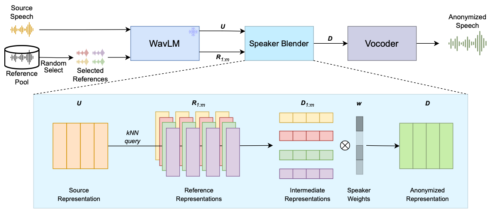
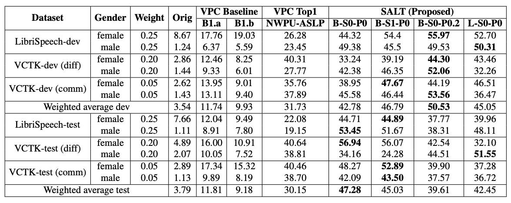
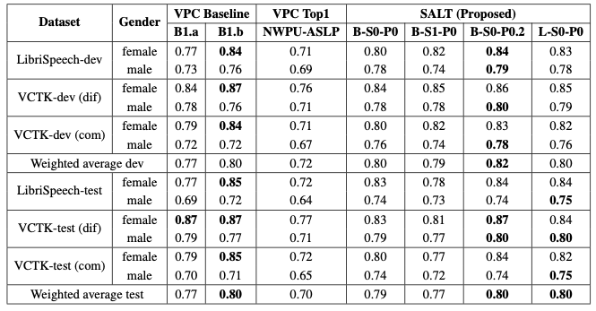
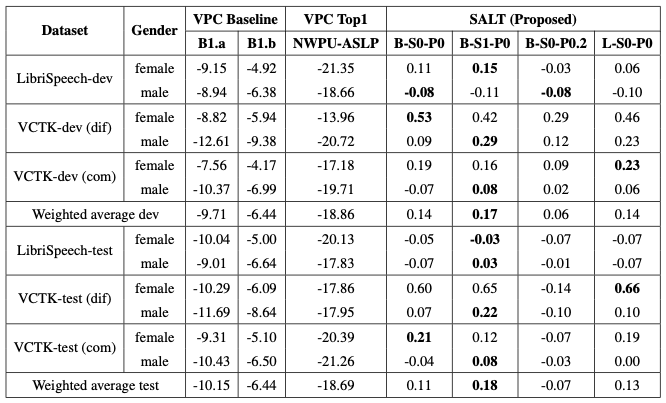
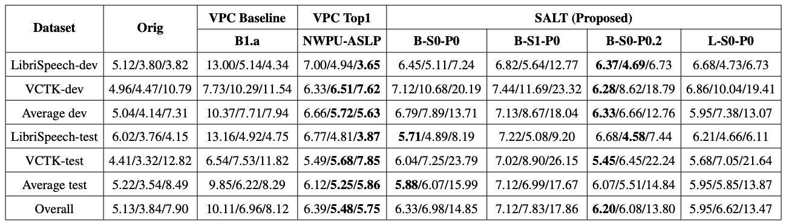

[戻る](../list.md)
# まとめ
音声の匿名化では、匿名化音声間での認識が難しい.
SALTでは、潜在空間への変換によってこの問題に対処する.
具体的には、自己教師あり特徴抽出によって得られた潜在特徴と重みをランダムにサンプルし、潜在ベクトルを補間する.

# 手法

## Encoder
WavLMを用いる.
$$
\begin{align*}
    \mathbf{U}&=\left[\mathbf{u}_{i}\right]_{i=1}^{T}=\operatorname{WavLM}\left(\mathbf{x}\right)\\
    \mathbf{R}_{\text{spk}}&=\left[\mathbf{r}_{i}\right]_{i=1}^{T_{\text{spk}}}=\operatorname{WavLM}\left(\mathbf{x}_{\text{spk}}\right)\qquad\text{where}\quad\text{spk}\in\left[0,N\right)
\end{align*}
$$

## Speaker Blender
$m$ 人の話者集合 $\mathbf{M}\subseteq\left[0,N\right)$ を定める.
各 $\text{spk}\in\mathbf{M}$ と各発話 $\mathbf{u}_{i}$ に対して、 $k$-近傍の対象となる発話を $\mathbf{D}_{\text{spk}}\left[i\right]$ とする.
$$
\mathbf{D}_{\text{spk}}=\left[\operatorname{kNN}\left(\mathbf{u}_{i},\mathbf{R}_{\text{spk}},k\right)\right]_{i=1}^{T}\qquad\text{where}\quad\text{spk}\in\mathbf{M}
$$

$$
w_{\text{spk}}=
\begin{cases}
    \mathcal{N}\left(0,1\right)&\text{if}\quad\text{spk}\in\mathbf{M} \\
    -\infty & \text{otherwise}
\end{cases}
$$
全時刻を対象とするのは、発話の非同期性によるものである.

$\sum w_{\text{spk}}=1$ の制約を満たすために、ソフトマックス関数を適用する.
$$
\mathbf{w}\leftarrow\operatorname{Softmax}\left(\mathbf{w}\right)
$$
この重みに対して、
$$
\mathbf{D}=\sum_{\text{spk}\in\mathbf{M}}w_{\text{spk}}\mathbf{D}_{\text{spk}}
$$
で話者を混合する.音声の質を考慮する場合は以下のようにしても良い.
$$
\mathbf{D}=p\,\mathbf{S}+\left(1-p\right)\sum_{\text{spk}\in\mathbf{M}}w_{\text{spk}}\mathbf{D}_{\text{spk}}
$$

## Vocoder
[HiFi-GAN](../../TTS/src/HiFi-GAN.md)-V1を採用した.
事前に潜在ベクトルと声を対応づけて、学習する.

# 実験
## データセット
VPC2022の評価方法と同じものを用いた.

## ベースライン
### $\mathbf{B1.a}$,$\mathbf{B1.b}$
VPC2022のものと同じ.

### NWPU-ASLP
VPC2022の一位.
- 擬似話者IDをlook-up-tableを内部に保持していて、それを元に埋め込みの平均を用いて匿名化とする.
- 音響モデルはその埋め込みを用いて、メルスペクトログラムを生成する.
- ボコーダーはそのメルスペクトログラムから、音声波形を生成する.ボコーダーは、匿名化音声を用いて事前訓練される.

## 結果
 
$ASV_{eval}^{anon}$ による評価.高いほど性能が良い.

 
$\rho^{F_{0}}$ による評価.
高いほど元の音声との同期が取れている.

 
$G_{\text{VD}}$ による評価.
高いほど話者の識別ができている.
0がoriginalと同程度の性能を意味する.

 
WER(Whisper Large/U2++/TDNN-F)による評価.
