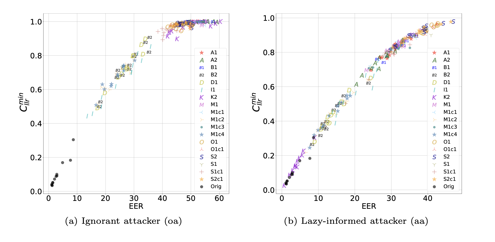
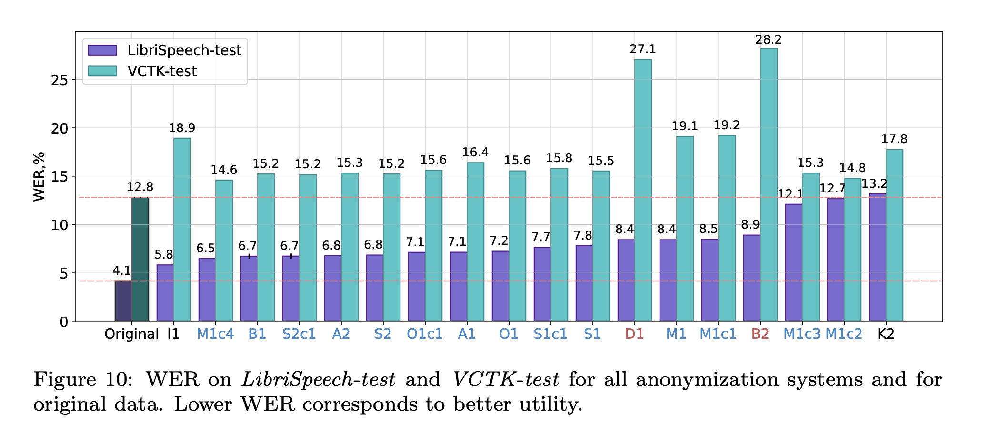

[戻る](../list.md)
# まとめ
VoicePrvacyChallenge2020の結果と分析についてのレビュー.

## 匿名化とは
「匿名化」のもつ個人情報の保護は従来のそれとは違い、個人の特徴の除去に加えてそれ自体が意味のあるものでなければならない.
つまり、匿名化後のデータは教師あり学習に用いることも出来る.

## Tasks
- 音声波形を出力すること.
- 話者の特徴を隠すこと.
- それ以外の会話の特徴を変えないこと.
- 同じ話者には同じ擬似話者を適用し、別の話者にはそれとは別の擬似話者を適用すること

## Requirements
- 下流タスクを、最善に達成すること.
  - 実際には、音声認識や話者認識モデルを用いて評価される.
  
## データセット
### 訓練データ
- VoxCeleb-1,2
- LibriSpeech
- LibriTTS
### 開発用データ
enrollmentとtrialに分ける.
- LibriSpeech dev-clean
  - enrollment $\subseteq$ trial
- VCTK-dev (subset of the VCTK corpus)
  - enrollmentとtrialには同じ話者を採用する.
  - trialはさらに、common(同じ発話内容)とdifferent(異なる発話内容)の2つに分けれらる.
  - enrollmentとdifferentには同じ話者の異なる発話が含まれる.

## 客観的指標
- ASV(自動話者認証)
  - 話者埋め込み(x-vector)を用いて、同一人物による発話かどうかを対数尤度比で出力する.
- ASR(自動音声認識)
  - 単語系列を出力する.

$\text{ASV}_{\text{eval}}$と$\text{ASR}_{\text{eval}}$はともに、LibriSpeech-train-clean-360で訓練する.
また、事後解析用に$\text{ASV}_{\text{eval}}^{\text{anon}}$と$\text{ASR}_{\text{eval}}^{\text{anon}}$を匿名化後のデータで訓練した.

これらは、EER, LLR-based const function, DeID, GVD, WERを用いて定量的に評価される.

### 攻撃シナリオ
- $Unprotected$
  - 元のennrollmentとtrialを知っている.
- $Ignorant Attacker(oa)$
  - 元のenrollmentと匿名化したtrialが流出.
- $Lazy$-$informed(aa)$
  - 匿名化したenrollmentとtrialが流出.以下2パターンのシナリオへの評価に有効.
    - 匿名化した音声から、同じ話者の別の匿名化音声を推測する.
    - 元の音声を持っているとき、攻撃者が同じシステムで匿名化して似せる(似てしまう).
- $Semi$-$informed$
  - 知っていることは$aa$と同じ.$\text{ASV}_{\text{eval}}$と同じ訓練データと匿名化システムを用いて、再学習し自前のASVを作成する.
  - 最強の攻撃手法であり、事後解析用に使われる.

## 主観的指標
以下の3項目について、評価者に主観的に評価してもらう.
- 音声の自然さ
- 音声の聞き取りやすさ
- 話者の照合性

以下の項目についても、主観的に評価してもらう.
- 話者のリンク可能性

## 匿名化システム
### $\mathbf{B1}$(ベースライン)

| モジュール | 出力 | 訓練データ |
|:-:|:-:|:-:|
| TDNN-F ASR AM | BN features | LibriSpeech train-clean-100,  train-other-500 |
| TDNN | x-vector | VoxCeleb-1,2 |
| Anonymization | x-vector | LibriTTS train-other-500 |
| SS AM |  | LibriTTS train-clean-100 |
| NSF |  | LibriTTS train-clean-100 |

- ASR AM(音響モデル)から、256次元のBN特徴量(中間表現)を抽出する.
  - 発話内容(発音)の特徴量である.
- TDNNから、512次元のx-vectorを抽出する.
  - 話者の特性を持つ特徴量である.
- x-vectorを$N$個もつPoolから、$N^{\ast}$個のx-vectorをPLDA距離に基づいて選び、平均化し、x-vectorを匿名化する.
- そのx-vectorとF0(基本周波数), BN特徴量から、メルフィルターバンク特徴量をSS AMで生成する.

### $\mathbf{B2}$(ベースライン)

機械学習を用いず、音声処理によって匿名化する.
- 音源フィルタ理論にLPC(線形予測分析)を適用し、係数$a$と残差$e$を求める.
  - $s\left(n\right)=-\sum_{i=1}^{p}a_{i}s\left(n-i\right)+e\left(n\right)$
- $z$変換して、極を求める.
  - $S\left(z\right)=\displaystyle\frac{1}{1+\sum_{i=1}^{p}a_{i}z^{-i}}E\left(z\right)$
- 虚数極の偏角$\phi\in\left[0,\pi\right]$を、McAdams係数$\alpha\approx1$を用いて$\phi^{\alpha}$で変換する.
  - この変換は$\phi=1$を基準に縮小・拡大することを意味する.$\phi\approx1$は2.5kHzに対応し、平均フォルマント位置に概ね一致する.

### $\mathbf{B1}$ベースのシステム

#### $\mathbf{F0}$
$\mathbf{A}$だけが、x-vector抽出器を修正した.WORLDやSPTKで代替したが、音声認識の精度では顕著な影響はなかった.一方で、話者認識の精度では多少の変化があったが、一貫したものではなかった.
事後解析によると、F0等計量を擬似わしゃのそれに置き換えることで、音声認識の精度に大きな影響を与えずに匿名性が向上することがわかった.

#### $\mathbf{ASR}$ $\mathbf{AM}$, $\mathbf{SS}$ $\mathbf{AM}$, $\mathbf{NSF}$
$\mathbf{M1}$と$\mathbf{M1c1}$は、BN特徴量抽出器としてTDNN-FのASR AMモデルの代わりにCTCやAttensinoを用いたend-to-endのアーキテクチャを採用した.

#### $\mathbf{X}$-$\mathbf{vector}$ $\mathbf{anonymization}$
各チームが異なる手法を採用した.
##### $\mathbf{A2}$ Singular value modification
元の話者のx-vectorと最も遠いクラスタリングの重心をターゲットに採用する.(方法は明記されていないが、いくつか選ぶ.)
それらを特異値分解して、非0の特異値をある閾値で切り捨てて、匿名化されたx-vectorを得る.
##### $\mathbf{A1}$ Variability-driven decomposition with regression models
事前に、プールのx-vectorを用いて、x-vector $\mathbf{x}$ の変動性(分散)の大きい成分$\mathbf{y}=\left(y_{1},\dots,y_{m}\right)^{T}$と小さい成分$\mathbf{y}=\left(z_{1},\dots,z_{n}\right)^{T}$に分割するようなインデックスを決めておく.
また、プールのx-vectorを用いて、x-vectorを類似度の低いクラスタリングの重心に変換する回帰モデル2つを事前学習しておく.
$\mathbf{y}$には非線形回帰モデルを、$\mathbf{z}$には線形モデルが割り当てられ、$\mathbf{y}^{\prime},\mathbf{z}^{\prime}$を得る.
成分が対応するように$\mathbf{x}^{\prime}$へと再構成し、$\mathbf{x}\rightarrow\mathbf{x}^{\prime}$の変換とする.
##### $\mathbf{O1}$ Distribution-preserving x-vector generation
擬話者のx-vectorとしてクラスタの重心を採用すると、擬話者の多様性が生まれず、なりすましが容易である.
そこで、生成モデルとしてGMMを使用する.
GANは、その学習方法から、訓練データと似た出力をすることがあり、どのデータが訓練データに使われているかを推定できることがあるため適さない.
GMMは、大量の事前データを用いたPCA分析によって圧縮されたx-vectorに対して適用され逆変換してx-vectorが生成される.
PCA+GMMの利点として、話者間のcosine距離が保持されることが挙げられる.
##### $\mathbf{O1c1}$ Forced dissimilarity between original and anonymized x-vectors
$\mathbf{O1}$の変種.
この合成されたx-vectorは元のx-vectorとよく似る可能性があるため、cosine距離が閾値よりも小さければ再サンプリングすることもある.
##### $\mathbf{S1c1}$&$\mathbf{S2c1}$ Domain-adversarial training
ANNを用いて、匿名化情報からドメイン(話者ID、性別、アクセント)を特定できないようなx-vectorへと変換する.
[DANNの概説](DANN.md) 
$\mathbf{S2c1}$は、再構成と識別のトレードオフを最適にするため、ハイパーパラメータ$\lambda$を調整したものである.
##### $\mathbf{S1}$&$\mathbf{S2}$ Domain-adversarial training on top of $\mathbf{B1}$
DANNを$\mathbf{B1}$の方法で匿名化したx-vectorに適用したもの.
##### $\mathbf{M1c2}$ Copy-synthesis
x-vectorの匿名化を行わない$\mathbf{B1}$ベースのモデルであり、$\mathbf{B1}$の手法と比較するために作られた.
NSF、SS AMには元のx-vectorが与えられる.
##### $\mathbf{M1c3}$ Original x-vectors for NSF
NSFには元のx-vectorを、SS AMには匿名化x-vectorを与えたモデル.
$\mathbf{B1}$の手法と比較するために作られた.
##### $\mathbf{M1c4}$ Original x-vectors for SS AM
NSFには匿名化x-vectorを、SS AMには元のx-vectorを与えたモデル.
$\mathbf{B1}$の手法と比較するために作られた.
##### $\mathbf{A}$ & $\mathbf{O}$ Speaker pool augmentation
x-vector匿名化手法の変更に加え、プールにデータセットを追加した.
グループ$\mathbf{A}$はLibriTTS-train-clean-100を、グループ$\mathbf{O}$はVoxCeleb-1,2を採用した.

### $\mathbf{B2}$ベースのシステム
#### $\mathbf{D1}$ Modifications of the pole radius
虚数極の偏角は$\mathbf{B2}$と同じMcAdams係数0.8でずらすことに加え、極の原点からの距離は0.975倍に縮小した.

### その他のシステム
#### $\mathbf{K2}$ Anonymization using x-vectors, SS models and a voice-indistinguishability metric

あるx-vectorを匿名化するために、x-vectorプールからの抽出方法を理論的に評価し、実装した.元のx-vectorとプール内のx-vectorとの距離で定まる確率で抽出する.[(具体的な説明)](Voice-Ind.md)
その後の音声合成においては、Fbank(発話内容)と匿名化x-vectorのみを用いる.
End-to-EndモデルでMelスペクトログラムを合成し、それを線形スペクトルに変換した後、波形ボコーダで音声波形を合成する.

#### $\mathbf{I1}$ Modifications to formants, F0 and speaking rate
LibriSpeech-train-other-500内の話者をランダムに選んで、F0や発話スピードをその人合わせる.他にはF、F5フォルマントを交換することなども行なっている.

## 結果
### 客観的指標
#### 話者認証

匿名化後の音声から元の話者を推定する$\text{ASV}_{\text{eval}}$でのEERである.
$$
\text{x-vector匿名化}>音声信号処理>非匿名化
$$
の関係が成り立っている.
$aa$では、$\mathbf{B1}$ベースのモデルが全体的に良い結果を残した.

$\mathbf{K1}$は$oa$が低いEERを記録しているのは、データベース$\mathcal{D}$が評価データと同じデータセットからx-vectorを抽出しているためだと考えられる.
$\mathbf{K1}$は入力に近いx-vectorを高確率で選ぶため、匿名化後のx-vectorが元のx-vectorと同じ話者によるものになりうる.
その結果、$\mathbf{Original}$のEERとほぼ変化がない.

各モデルの$C_{\text{llr}}^{\min}$とEERでの大小には強い関係が認められた.(EERを$C_{\text{llr}}^{\min}$として損失関数に組み込むことができる?)

各システムがLibriSpeech-train-clean-360を匿名化したデータセットに対応する$\text{ASV}_{\text{test}}^{\text{anon}}$のEER.

#### 音声認識

各評価データにおける$\text{ASR}_{\text{eval}}^{\text{anon}}$でのWERである.

$\mathbf{M1c2},\mathbf{M1c3},\mathbf{M1c4}$の結果から、音声の再合成では音声認識の精度が顕著に下がることがわかる.
つまり、再合成よりも異なるx-vectorを用いた合成の方が音声認識の精度を損なわない.

$\mathbf{M1}$,$\mathbf{M1c1}$の結果から、End-to-EndのASR AMを用いたBN特徴量を抽出すると、音声認識の精度が下がることがわかる.

x-vectorベースのモデルでは、訓練データにないデータでは音声認識の相対的な精度が顕著に下がった.
一方で、$\mathbf{B2}$ベースのシステムでは相対的な精度の劣化は一定であった.

各システムが匿名化したデータセットに対応する$\text{ASR}_{\text{eval}}^{\text{anon}}\left(o\right)$のWER.

匿名化音声に対して音声認識モデルを再訓練することで、実用化レベルにまでWERを低下させることができる.

### 主観的指標

$$
\begin{pmatrix}
  M_{oo} & M_{oa} \\
  M_{oa} & M_{aa}
\end{pmatrix}
$$

$\mathbf{K2}$は$M_{aa}$で高い匿名性が見られた.

$\mathbf{B1}$ベースのシステムの高い匿名性に対して、$\mathbf{B2}$ベースのシステムでは高い音声認識率が見られた.

$\mathbf{M1c2},\mathbf{M1c4}$の結果から、コピー合成が音声認識率を低下させる一方で、$\mathbf{B2}$ベースのシステムと同等の匿名性を獲得していることがわかる.

### 主観的指標

すべての匿名化システムは、元の音声の結果よりも悪化しており、$p\ll0.01$で統計的に有意な差であった.
音声の自然さの観点で、$\mathbf{I1}$の結果は他と比べて高かったが、元の音声に比べてかなり差がある.

スコアの閾値を変化させたときの、Miss(偽陰性)率とFalse Alarm(偽陽性)率のDET(Detection Error Trade-Off).
右上ほど性能が高い.

$\mathbf{B1},\mathbf{B2}$ベースのシステムとそうでないシステム($\mathbf{I1},\mathbf{K2}$)とでは、音声の自然さと明瞭さで大きく結果が異なった.
$\mathbf{I1}$以外のシステムは、$\mathbf{B2}$よりも精度が低く、$\mathbf{K2}$は一番低かった.

個人情報の保護(匿名化)の観点では、$\mathbf{K2},\mathbf{S2},\mathbf{I1}$の性能が高かったが、これらは自然さ・明瞭さの観点では大きく異なった結果となっていることに注意したい.

どのシステムも、自然で明瞭な音声を生成することができなかった.
