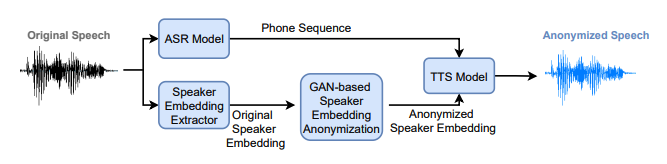
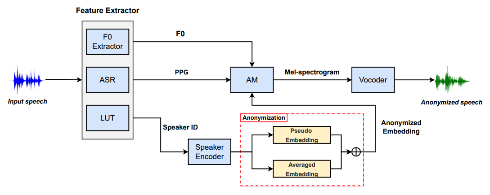
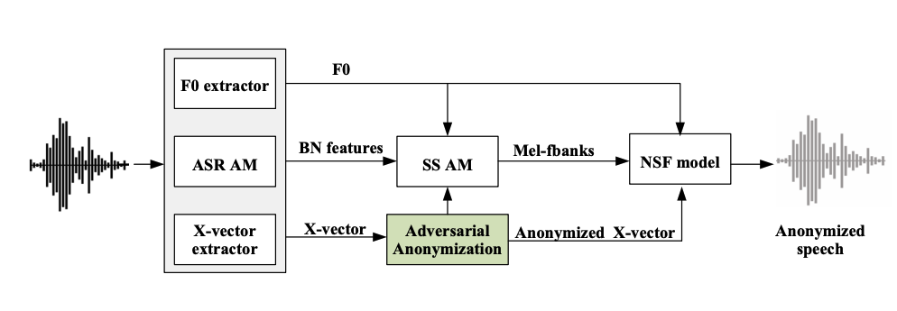
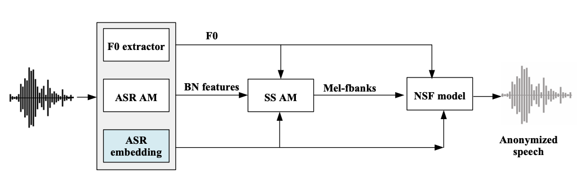
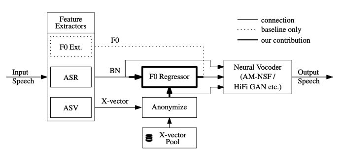
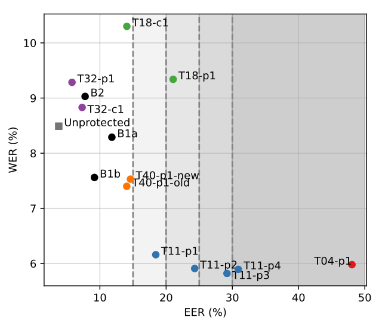
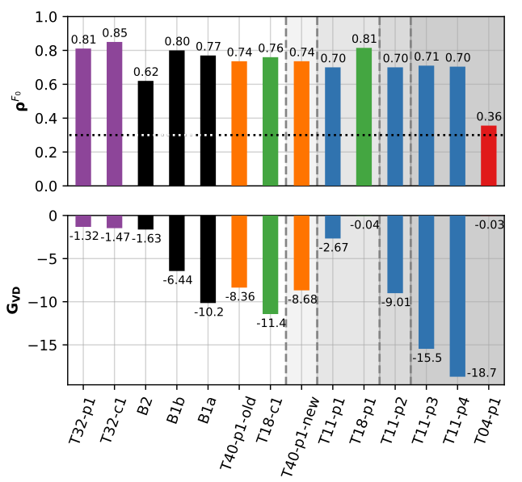
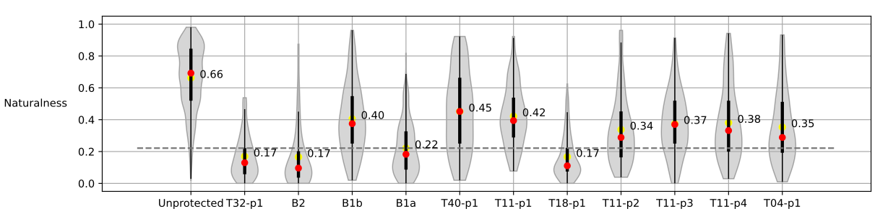
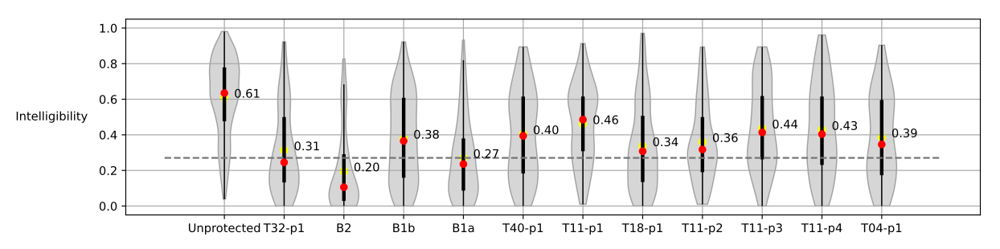
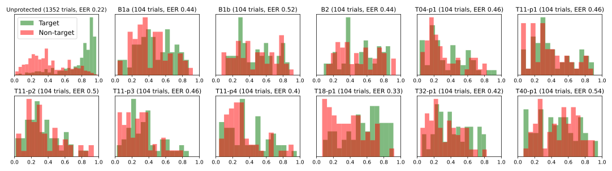

[戻る](../list.md)
# まとめ
VoicePrvacyChallenge2022の結果と分析についてのレビュー.

## 音声プライバシー保護の現状
声の音色や性などの個人情報などの秘匿化が求められているが、このコミュニティは匿名化に注力している.

## データセット

モデルの訓練・評価に使うデータセット.

攻撃モデルに使うデータセット.

## 評価指標
### A.新たな客観的指標
VPC2020では、参加者はプライバシーと実用性の適切なトレードオフを自分で定める必要があり、それぞれが異なる指標で最適化を試みていた.
そこでVPC2022では、徐々に上昇するプライバシー条件(EER)を満たしたシステムが実用性(WER)についてランク付けされる.
15%,20%,25%,30%の段階的な条件を満たすConditionに提出することができる.
EER、WERは評価用データセットの重み付き(VPC2022では等重み付き)で平均で計算される.

### B.他の客観的指標
#### 1.ピッチ相関 $\rho^{F_{0}}$
ピッチの相関係数.
各データセットで閾値を超える必要があり、ベースラインをもとに、$\rho^{F_{0}}>0.3$が要求される.

#### 2.音声の独自性 $G_{\text{VD}}$
$$
M\left(i,j\right)=\text{sigmoid}\left(\frac{1}{n_{i}n_{j}}\sum_{\substack{1\leq k\leq n_{i}\\1\leq\ell\leq n_{j}\\k\neq\ell\text{ if }i=j}}\text{LLR}\left(x_{k}^{\left(i\right)},x_{\ell}^{\left(j\right)}\right)\right)
$$
$x_{k}^{\left(i\right)}$は発話$k$が話者$i$によるものである確率である.
つまり、$M\left(i,j\right)$は、話者$i$と$j$の類似度を表す指標だと考えられる.

$M$の対角成分の相対的な大きさは、
$$
D_{\text{diag}}\left(M\right)=\left|\sum_{1\leq i\leq N}\frac{M\left(i,i\right)}{N}-\sum_{\substack{1\leq j\leq N\text{ and }1\leq k\leq N\\j\neq k}}\frac{M\left(j,k\right)}{N\left(N-1\right)}\right|
$$
であり、話者認証の精度を表す指標である.

そして、2つのシチュエーションにおけるこの指標の相対的な評価は以下で与えられる.
$$
G_{\text{VD}}=10\log_{10}\frac{D_{\text{diag}}\left(M_{aa}\right)}{D_{\text{diag}}\left(M_{oo}\right)}
$$
$G_{\text{VD}}$が0と比べて大きいほど、精度が元よりも向上したことを表す.

## 匿名化システム
### ベースライン
#### ベースライン$\mathbf{B1}$

##### ベースライン$\mathbf{B1.a}$
VPC2020bの$\mathbf{B1}$と同じである.
##### ベースライン$\mathbf{B1.b}$
$\mathbf{B1.a}$の音声合成のモジュールを[HiFi-GAN](../../TTS/src/HiFi-GAN.md)をベースにしたシステムに置き換えたもの.
#### ベースライン$\mathbf{B2}$
VPC2020の$\mathbf{B2}$とほぼ同じ.
MaAdams係数$\alpha$を$\left(\alpha_{\min},\alpha_{\max}\right)$の範囲から選ぶことが相違点.

### 提出されたシステム
各システムは\<team number>-\<'p' if primary 'c' if contrasive>-\<incremental identifier>のフォーマットで表される.
### Team $\mathbf{T04}$

#### Speech Recognition Module
- [Hybrid CTC/Attension ASR モデル](../../ASR/src/Hybird-CTCAttension.md)[ESPnet2 toolkit]を用いて音声データをテキストデータへ変換する.
- エンコーダーはConformerで、デコーダーはTransformerである.
- 100ユニグラム言語モデルを仮定し、音素単位に分割した[IMS Toucan toolkit]文字起こしを用いてSεntencePieceを学習した.
- データ拡張(SpecAugument,3-way speed perturbation)をしたデータで学習を行なった.

#### Speaker Embedding Extraction Module
- ECAPA-TDNNの中間表現192次元とx-vector512次元を結合した、704次元の話者埋め込みを用いる.

#### Speaker Embedding Anonymization Module
- 人工的な話者埋め込みを生成するために、WGAN-QCを用いる.
- WGANは、GANのDiscriminatorではなく、Criticという本物と偽物の分布の距離を縮めるネットワークを用いる.
- GeneratorおよびCriticは簡略化されたResNetを用いて実装されている.
- ResNetの代わりに同じパラメータ数のMLPを用いたところ、学習の収束が遅くなった.
- 匿名化では元の話者の情報が一切使用されない.男女それぞれの声を生成するGANの構築を試みたが、データが十分でなかったため、1つのGANを用いる.

#### Speech Synthesis Module
- TTSモジュールは FastSpeech 2 で、IMS Toucan toolkit によって実装され、学習データには LibriTTS-clean-100 を使用した.
- FastSpeech 2 は、堅牢性と速度に重点を置いた音声合成のモデルである.
- Encoder および　Decoder には Conformer を用いた.
- スペクトログラムから音声波形への変換には HiFi-GAN を用いた.

### Team $\mathbf{T11}$

- F0 軌跡の代わりに、Yingram を用いた.
- BN 特徴量は U2++ と WeNet toolkit を用いて抽出された.
- LUT の $N$ 人から $K$ 人の話者埋め込みを LUT から選んで平均化する.これを擬似話者埋め込みとし、これと話者の埋め込みの平均との重み付き平均で $\left(N+1\right)$ 次元の匿名化埋め込みとする.
- 話者の埋め込みの平均を取る理由は、ある発話は同じ擬似話者から発せられるという制約を満たすためである.
- Tacotron 2 がスペクトログラムを出力し、HiFi-GAN が音声波形へと変換する.

### Team $\mathbf{T18}$
#### 匿名化手法1

- 話者の x-vector に敵対的摂動を加えて、匿名化する.
$$
Y_{i}=X_{i}+noise_{adv}
$$
#### 匿名化手法2

- Trans Former 型の ASR モデルのエンコーダーは話者性も埋め込むという事実から、これを x-vector 抽出機として採用する.

### Team $\mathbf{T40}$

- 既存の F0 抽出器 YAAPT を、BN 特徴量と擬話者埋め込みを用いる回帰モデルに置き換えた.
- F0 の概形にある個人情報を抑制する効果が見込まれる.

### Team $\mathbf{T32}$
- 唯一の $\mathbf{B2}$ ベースのシステム.
- F0 の高さや速度を変更することにより匿名化する.

### 傾向
#### 特徴量抽出
大半のシステムが以下3つの特徴量を抽出している.
- 話者埋め込み
  - $\mathbf{T04}$ は、x-vector に加えてECAPA-TDNN の中間表現を用いている.
- 言語埋め込み
  - TDNN-F の代わりに WeNet も用いられることもある.
- ピッチ軌跡
  - YAAPR の代わりに Yingram が用いらることもある.
#### 匿名化
- $\mathbf{T04}$ は GAN を用いた.
- $\mathbf{T11}$ は one-hot 表現を用いた話者表現を用いた.
- $\mathbf{T18}$ は敵対的摂動を用いた.
### 音声合成
x-vector を用いているほぼ全てのシステムでは、HiFi-GAN が用いられている.

## 結果
### 客観的指標
 
Unportected は $ASV_{eval}$ と $ASR_{eval}$ による指標を用い、他のシステムは $ASR_{eval}^{anon}$ と $ASR_{eval}^{anon}$ による指標を用いている.
波線は、各 Condition のボーダーラインである.

 
各システムはEER の低い順にソートされている.
$\rho^{F_{0}}$ の水平波線は、提出するための閾値である.

- $\mathbf{T11}$-$\mathbf{p4}$ が最低の $G_{VD}$ を記録しており、一般に高い匿名性 (EER) は、低い話者識別性($G_{VD}$)となることが考えられる.
- $\mathbf{T11}$ が最も優れた WER を記録したものの、$G_{VD}$ では大幅な劣化が見られる.
- $\mathbf{T04}$-$\mathbf{p1}$ は、最も優れた匿名性と話者識別性を記録した一方で、$\rho^{F_{0}}$ では最も低い値となった.
- $\mathbf{T18}$ は、$\rho^{F_{0}}$ と $G_{VD}$ の両方で改善が見られた.

### 主観的指標
 
波線は $\mathbf{B1.a}$ の平均スコアである.
- $\mathbf{B1.a}$ と比べて $\mathbf{T40}$-$\mathbf{p4}$ が高かった.NSF モデルには Fbank 特徴量ではなく、BN 特徴量を直接入力した方が自然に聞き取りやすいのかもしれない.
- $\mathbf{B1.a}$ , $\mathbf{T18}$-$\mathbf{p1}$ の結果から、敵対的な訓練をしたモデルほど自然に聞き取ることができることがわかる.一方で、ASR+TTS も匹敵するような記録を残している.
- 信号処理ベースのモデルは、最低の記録となっている.

 
波線は $\mathbf{B1.a}$ の平均スコアである.
- Naturalness 同様に、敵対的訓練をしたモデルと ASR+TTS のモデルが競合している.

Target (同じ話者での匿名性) 、Non-Target (別の話者での匿名性) の EER は共に低い方がいい.

## 事後分析
- WER の結果から、匿名化は「客観的な」明瞭性を向上することができることがわかった.一方で、「主観的な」明瞭性は下がっており、矛盾が生じている.
  - $1-$WER と明瞭性、自然性との相関係数はそれぞれ 0.14、0.05 であり、相関が認められない.しかしながら、明瞭性と自然性との相関係数は 0.58 であり、中程度の相関が認められた.
  - 評価者に文字の書き起こしをしてもらうなど、主観的な評価方法は考えていくべきである.
- パラ言語情報の保存を目的として、ピッチ相関の閾値が設定されたが ASR+TTS のモデルがその基準をクリアしてしまった.しかし、 EER、WER、$G_{VD}$ の結果を考慮すると、ASR+TTS は注目すべき技術であると言える.
  - 各モデルの出力に対して DTW を用いて $F_{0}$ の相関係数が高くなるようにしたところ、0.9 以上となった.
  - ただし、ASR+TTS の $\mathbf{T04}$-$\mathbf{p1}$ の出力の相関係数は 0.83 であった.
  - $\rho^{F_{0}}\geq0.3$ は低すぎる基準であったと言える.
- 元の音声に対する $ASR_{eval}$ よりも匿名化音声に対する $ASR_{eval}^{anon}$ の方が性能が良かった理由として、匿名化システムがたくさんのデータセットを用いており、その知識が漏れ出ていることが指摘できる.であれば、これら2つの $ASR$ はそれらも含めたデータで学習すべきであるが、データの重複などによって問題が生じる可能性がある.

## 事後評価と結果
### Anonymization Function
- OHNN を用いて、$\mathbf{x}^{a}=f_{\Theta}\left(\mathbf{x}^{o}\right)$ に変換する.
  - 匿名性の観点から $\mathbf{x}^{o}$ と $\mathbf{x}^{a}$ の距離を最大にしたい.
  - 一方で、異なる話者による $\mathbf{x}^{a}$ は区別されるべきなので、OHNN の学習においてはクラスタ間の距離も考慮される.
- Semi-informed において約50%の EER を達成した.

### Vocoder contributions to anonymisation
- ボコーダーに渡される x-vector と生成された音声波形の x-vector が異なることがある.
  - 他の入力(言語的特徴量)などに元の個人情報が混入しており、それを再現してしまう可能性を否定できない.

### Privacy Leakage
- 言語的特徴量に個人の情報が漏れ出ている可能性があるため、量子化することで情報の解像度を下げる.
  - EER の上昇が見られたが、同時に WER の上昇も確認された.

### Alternatives to x-vector Speaker Embeddings
- flow-based TTS
  - 発話から得られたスペクトログラム $s$ から、 話者埋め込み $z$ を得る.
    - 条件 $c$ のもと、$s$ から潜在変数と生成.
    - $z=f\left(s\middle|c\right)$
    - $z$ が特定の分布 $p$ に従うように学習されている.
  - 擬似話者埋め込み $z^{\prime}\sim p$ を再サンプルして、逆変換によってスペクトログラム $s^{\prime}$ を得る.
    - $s^{\prime}=f^{-1}\left(z^{\prime}\middle|c\right)$
- (Trans former ベース)
- (Formant ベース)
