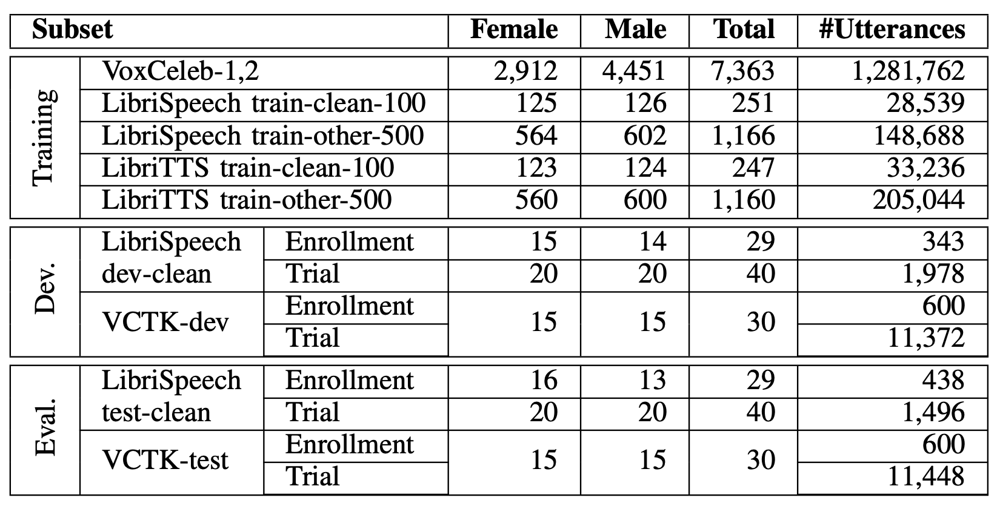
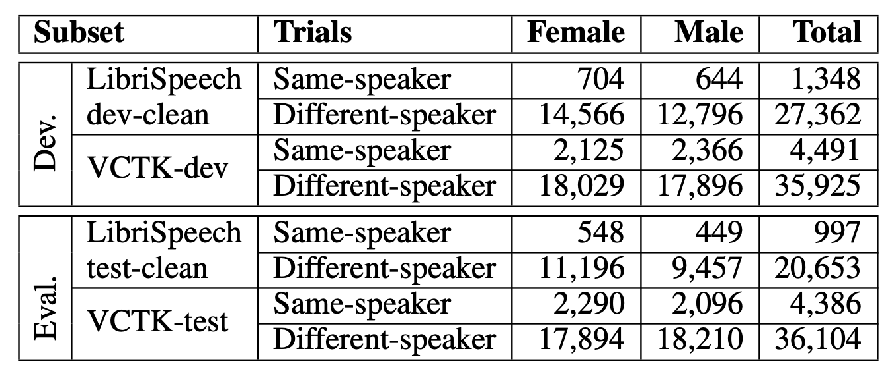
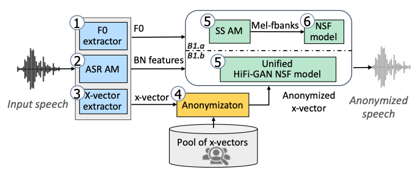

[戻る](../list.md)
# まとめ
VoicePrvacyChallenge2022の結果と分析についてのレビュー.

## 音声プライバシー保護の現状
声の音色や性などの個人情報などの秘匿化が求められているが、このコミュニティは匿名化に注力している.

## データセット

モデルの訓練・評価に使うデータセット.

攻撃モデルに使うデータセット.

## 評価指標
### A.新たな客観的指標
VPC2020では、参加者はプライバシーと実用性の適切なトレードオフを自分で定める必要があり、それぞれが異なる指標で最適化を試みていた.
そこでVPC2022では、徐々に上昇するプライバシー条件(EER)を満たしたシステムが実用性(WER)についてランク付けされる.
15%,20%,25%,30%の段階的な条件を満たすConditionに提出することができる.
EER、WERは評価用データセットの重み付き(VPC2022では等重み付き)で平均で計算される.

### B.他の客観的指標
#### 1.ピッチ相関 $\rho^{F_{0}}$
ピッチの相関係数.
各データセットで閾値を超える必要があり、ベースラインをもとに、$\rho^{F_{0}}>0.3$が要求される.

#### 2.音声の独自性 $G_{\text{VD}}$
$$
M\left(i,j\right)=\text{sigmoid}\left(\frac{1}{n_{i}n_{j}}\sum_{\substack{1\leq k\leq n_{i}\\1\leq\ell\leq n_{j}\\k\neq\ell\text{ if }i=j}}\text{LLR}\left(x_{k}^{\left(i\right)},x_{\ell}^{\left(j\right)}\right)\right)
$$
$x_{k}^{\left(i\right)}$は発話$k$が話者$i$によるものである確率である.
つまり、$M\left(i,j\right)$は、話者$i$と$j$の類似度を表す指標だと考えられる.

$M$の対角成分の相対的な大きさは、
$$
D_{\text{diag}}\left(M\right)=\left|\sum_{1\leq i\leq N}\frac{M\left(i,i\right)}{N}-\sum_{\substack{1\leq j\leq N\text{ and }1\leq k\leq N\\j\neq k}}\frac{M\left(j,k\right)}{N\left(N-1\right)}\right|
$$
であり、話者認証の精度を表す指標である.

そして、2つのシチュエーションにおけるこの指標の相対的な評価は以下で与えられる.
$$
G_{\text{VD}}=10\log_{10}\frac{D_{\text{diag}}\left(M_{aa}\right)}{D_{\text{diag}}\left(M_{oo}\right)}
$$
$G_{\text{VD}}$が0と比べて大きいほど、精度が元よりも向上したことを表す.

## ベースライン
### ベースライン$\mathbf{B1}$

#### ベースライン$\mathbf{B1.a}$
VPC2020bの$\mathbf{B1}$と同じである.
#### ベースライン$\mathbf{B1.b}$
$\mathbf{B1.a}$の音声合成のモジュールを[HiFi-GAN](HiFi-GAN.md)をベースにしたシステムに置き換えたもの.
### ベースライン$\mathbf{B2}$
VPC2020の$\mathbf{B2}$とほぼ同じ.
MaAdams係数$\alpha$を$\left(\alpha_{\min},\alpha_{\max}\right)$の範囲から選ぶことが相違点.

