[戻る](../list.md)
# まとめ
VoicePrvacyChallenge2024の実施内容.
## 評価指標
- $G_{VD}$ と $\rho^{F_{0}}$ の指標は使わない.
- 匿名化システムの学習に使えるデータセットとモデルのリストの公開.
- 主観的指標による評価を廃止し、以下3つの客観的評価指標を用いる.
  - 話者認識 ASV における等誤り率 $\textbf{EER}$
  - (自動)音声認識 ASR における単語誤り率 $\textbf{WER}$
    - 置換単語数 $N_{\text{sub}}$ 、削除単語数、$N_{\text{del}}$、挿入単語数 $N_{\text{ins}}$、正解文の単語数 $N_{\text{ref}}$ を用いると以下のようになる.
    - $\text{WER}=\displaystyle\frac{N_{\text{sub}}+N_{\text{del}}+N_{\text{ins}}}{N_{\text{ref}}}$
  - 音声感情認識 SER における非加重再現率　$\textbf{UAR}$
    - 再現率(recall)は、陽性に対する正解率である。各感情 $i$ における再現率を $R_{i}$ とすると以下のようになる。
    - $\text{UAR}=\displaystyle\frac{\sum_{i=1}^{N_{\text{class}}}R_{i}}{N_{\text{class}}}$
- $N$ 個の最低目標 EER $\left\{EER_{1},\dots,EER_{N}\right\}$ を満たすシステムでの実用性指標 WER,UAR が評価される.
  - $N=4$ で、$EER_{i}=10\times i\left(\%\right)$ である.

## タスク
### 要求
(a)音声波形を出力すること.

(b)発話レベルで、話者の個人情報を隠すこと.
- ユーザごとに擬似話者を割り当てるのではなく、発話ごとに擬似話者を割り当てる必要がある.

(c)言語的および感情的内容を変化させないこと.
- ASR の WER と SER の UAR によって評価される.

### 攻撃モデル
(a)各ユーザに対する登録発話を複数持っている. $\left(\geq1?\right)$

(b)ユーザの使用する匿名化システムへアクセスすることができる.
- 攻撃者が持つ ASV の EER によって評価される.

## 学習リソース
### モデルとデータ
表([リンク](https://www.voiceprivacychallenge.org/docs/VoicePrivacy_2024_Challenge_Final_list_of_models_and_data_for_training_anonymization_systems_-_26.03.2024.pdf))にあるモデルとデータセットのみを用いて良い.

### 開発・評価データ
#### LibriSpeech
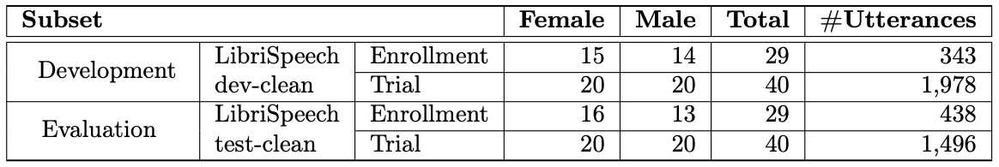
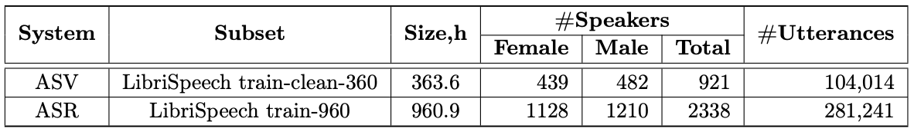
- 音声認識のために、オーディオブックから得られた英語のスピーチコーパス.
- 960時間のスピーチが16kHzでサンプリングされている.
- ASV は、LibriSpeech train-clean-360 によって学習される.
  - ECAPA-TDNN を用いた.
  - Speech Brain の VoxCeleb レシピを LivriSpeech に適用した.
  - 攻撃者は、LibriSpeech train-clean-360 を匿名したものを用いて ASV を学習する.
- ASR は、LibriSpeech train-960($=100+360+500$) によって学習される.

#### IEMOCAP
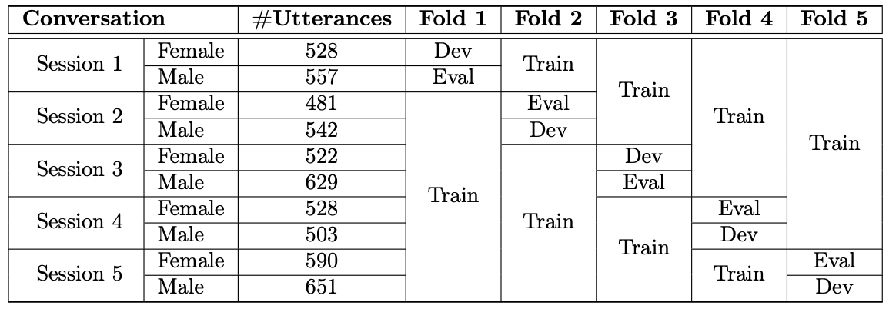
- 5人の女性俳優と5人の男性俳優による、即興および台本付きの2人の会話のデータセット.
- 12時間の会話が16kHzでサンプリングされている.
- 9つにアノテートされている感情のうち、$\textbf{neutral}$, $\textbf{sadness}$, $\textbf{anger}$,$\textbf{happiness}$ の4つ飲みを用いる.
  - 各クラスに分類される発話を分けるために、hippiness と excitement クラスを happiness クラスに統合した.

## ベースライン
### $\textbf{B1}$
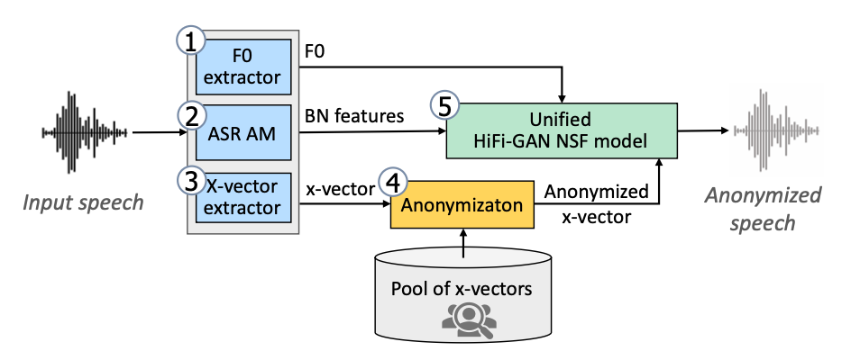
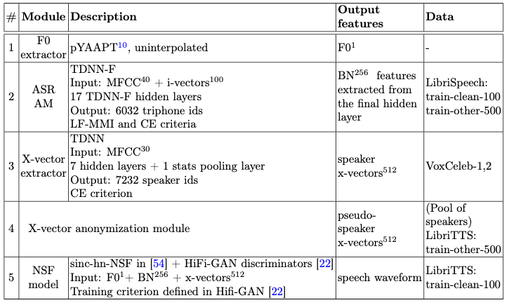
- $\textbf{Step1}$ Feature extraction
  - 基本周波数 $F_{0}$ の抽出
    - 信号が持つ最も周波数成分で、最も周波数の低いもの.
  - BN 特徴量の抽出
    - ASR モデルのボトルネック特徴量.
  - x-vector の抽出
    - ASV モデルの中間表現.
    - PLDA 分析によって類似度を計算する.
      - $x=\mu+Vy+\epsilon\qquad\epsilon\sim\mathcal{N}\left(0,\Sigma\right)$
        - $\mu$ は特徴量 $x$ の平均である.
        - $V,\Sigma$ がパラメータとして学習され、$\epsilon$ が正規分布となるような $y$ が計算される.
        - $y$ 得られた $y$ の値が発話内容によらない、話者特徴量と考えられる.
- $\textbf{Step2}$ X-vector anonymization
  - $N$ 人の x-vector から類似度の最も低い $N^{\ast}$ 人に対応する x-vector を平均化することによって、擬似話者の x-vector を作成する.
    - $\left(N,N^{\ast}\right)=\left(200,100\right)$ としている.
- $\textbf{Step3}$ Speech synthesis
  - 匿名化した x-vector と$F_{0}$ および BN 特徴量を用いて、NSF モデルから音声波形を出力する.

### $\textbf{B2}$
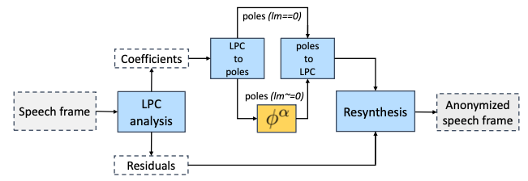
- LPC 分析をして、係数を求める.
  - $s\left(n\right)=\sum_{i=1}^{p}\alpha_{i}s\left(n-i\right)+e\left(n\right)$ で、$\alpha_{i}$ は $\sum_{t}\left\|e\left(t\right)\right\|^{2}$ を最小にする.
- $z$ 変換を施して、$S\left(z\right)=\sum_{i=1}^{p}\alpha_{i}z^{-i}S\left(z\right)+E\left(z\right)$ とする.
  - これは、以下のように変形可能である.
  - $\displaystyle\frac{S\left(z\right)}{E\left(z\right)}=\frac{1}{1-\sum_{i=1}^{p}\alpha_{i}z^{-i}}$
- 非実数極の偏角 $\phi\left(0<\phi<\pi\right)$ を、$\alpha\sim \mathcal{U}\left(\alpha_{\min},\alpha_{\max}\right)$ を用いて $\phi^{\alpha}$ へと変換する. $\pi\leq\phi<2\pi$については、共役な複素数の変換と共役になるようにする.
  - $\phi=1$ を基準に拡大・縮小をしている.これは、16kHz のサンプルレートにおいて、 2.5kHz の周波数に相当し、第1フォルトマンにおおよそ一致している.
  - $\left(\alpha_{\min},\alpha_{\max}\right)=\left(0.5,0.9\right)$ としている.
- 変換後の非実数極と実数極・残差 $e$ を用いて、音声を再合成する.

### $\textbf{B3}$
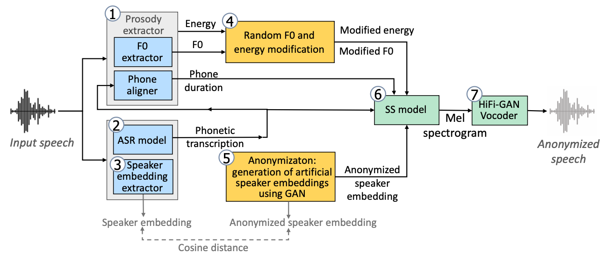
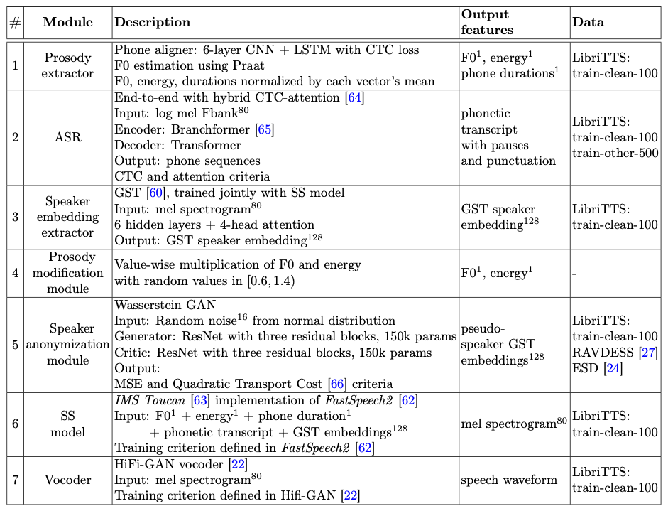
- $\textbf{Step1}$ Feature extraction
  - 正規化された、$F_{0}$ 、エネルギー、音素の継続時間(duration)系列の取得
  - 話者埋め込みの抽出
    - 適応型グローバルトークンモデルの出力による.
  - 音素系列の取得
    - ASR モデルによって、休止や句読点付きの音素系列を取得する.
- $\textbf{Step2}$ Speaker embedding anonymization
  - 話者埋め込みを GAN によって生成されたものに置換する
    - 元の埋め込みとのコサイン類似度が 0.3 を超えていれば、十分に似ていないと考えられる.
    - 超えていない場合は、この要件を満たすまで繰り返し生成する.
  - $F_{0}$ およびエネルギーを一様乱数 $\mathcal{U}\left(0.4,1.6\right)$ から取得した乱数でスケーリングする.
- $\textbf{Step3}$ Speech synthesis
  - 音素の継続時間系列、匿名化した話者埋め込み、スケーリングした $F_{0}$ およびエネルギーを用いて、メルスペクトログラムを生成する.
  - [HiFi-GAN](../../TTS/src/HiFi-GAN.md)を用いて、メルスペクトログラムから音声波形に変換する.

### $\textbf{B4}$
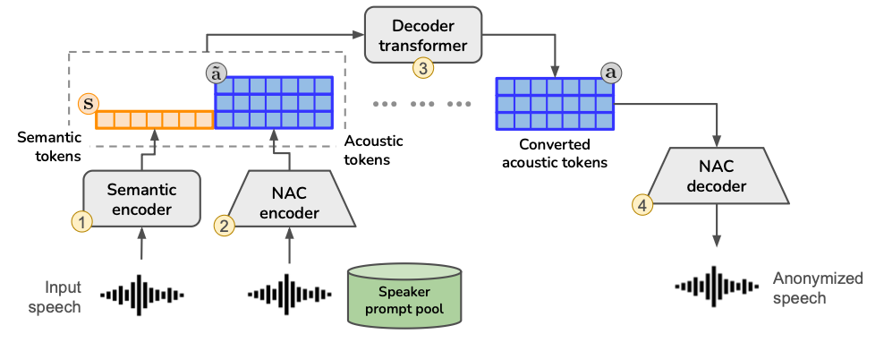
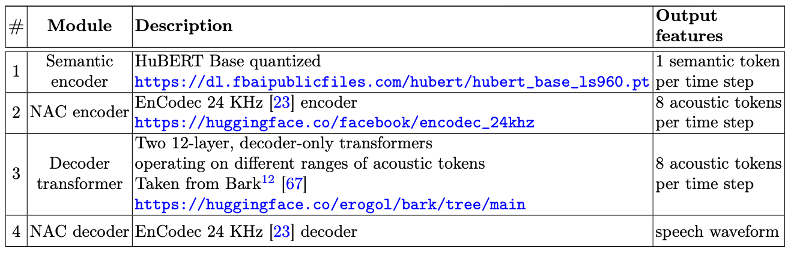
- 事前学習済みの Neural Aoudio Codec (NAC) を用意する.
  - エンコーダー・デコーダーモデルで、量子化されたトークン系列を採用している.
  - トークン $\mathbf{a}\in\left\{1,\dots,N_{Q}\right\}^{Q\times N_{A}}$ の要素 $\mathbf{a}_{q,t}$ は、時刻 $t$ における $q$ 番目のトークンを表す.
  - $\mathbf{a}_{\leq Q_{C},:}$ は大域的トークンを表し、一方で、$\mathbf{a}_{Q_{C}<,:}$ は局所的トークンを表す.
- 事前学習済みの　HuBERT と LSTM から量子化されたセマンティックトークン $\mathbf{s}\in\left\{1,\dots,N_{S}\right\}^{T_{S}}$ を得る.
- 話者プールから音声波形を NAC エンコーダーに通して $\tilde{\mathbf{a}}$ を得る.
- 以下の確率分布に従って $\mathbf{a}$ を得る.
  - $1\leq q\leq Q_{C}$ のとき、つまり、大域的トークンは、
    - $p\left(\mathbf{a}_{q,t}\middle|\mathbf{s},\tilde{\mathbf{a}}_{\leq Q_{C},:},\mathbf{a}_{\leq Q_{C},<t},\mathbf{a}_{<q,t}\right)$
    - 時刻1から順に、大域的な $\mathbf{a}$ を、既知の大域的トークン全てとセマンティックトークンを使用して求めることを意味する.
  - $Q_{C}<t$ のとき、つまり、局所的トークンは、
    - $p\left(\mathbf{a}_{q,:}\middle|\tilde{\mathbf{a}},\mathbf{a}_{<q,:}\right)$
    - ターゲット話者の全トークンと、すでに求めた大域的トークンのみを用いて求める.
    - セマンティックトークンは大域的トークンに埋め込まれていると仮定する.
  - $p$ は、transformer デコーダーを用いて実現される.

### $\textbf{B5}$ and $\textbf{B6}$
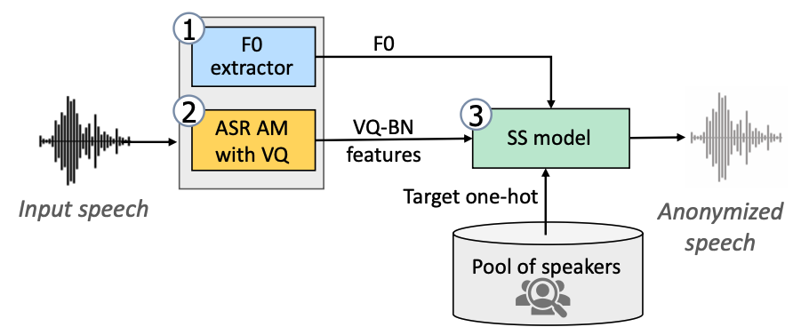
- $F_{0}$ 特徴量の抽出.
- 音響モデルから BN 特徴量を抽出し、ベクトル量子化する.
  - $\textbf{B5}$ では、事前学習済みの wav2vec2 に 3 つの TDNN-F 層を追加したものを使用する.
  - $\textbf{B6}$ では、12 層の TDNN-F 層で構成されるものを使用する. 
- $F_{0}$ および BN-VQ を SS モデルが受け取り、音声波形を出力する.
  - SS モデルには HiFi-GAN が使用されている.

## 結果
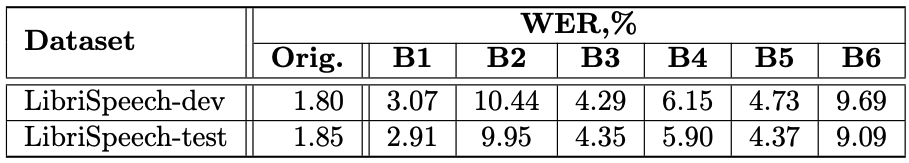
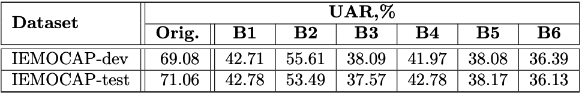
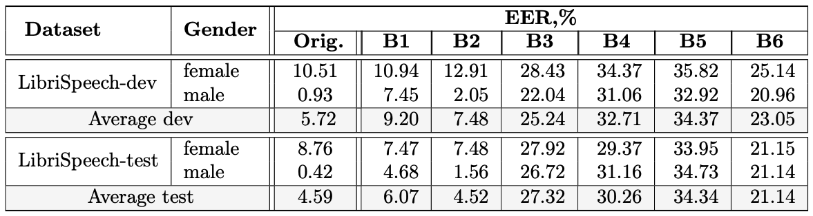
